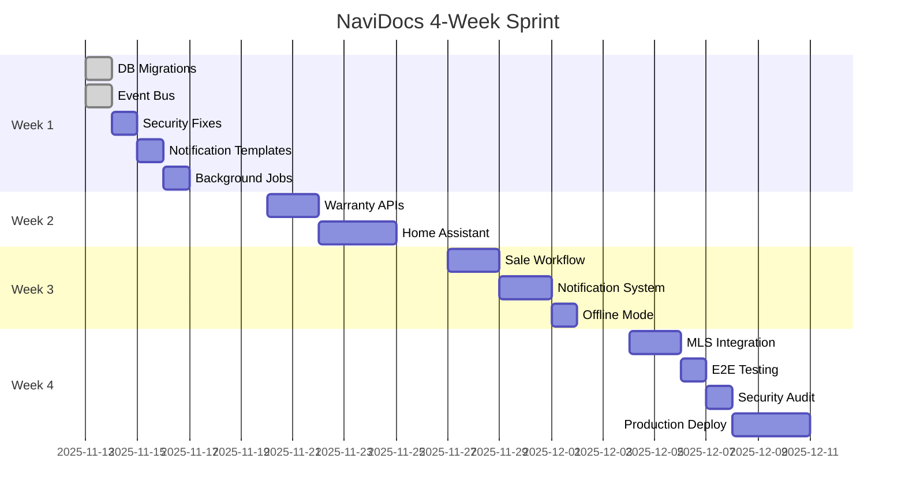

# Cloud Session 4: Implementation Planning
## NaviDocs 4-Week Sprint Execution Plan

**Session Type:** Project Manager + DevOps Specialist
**Lead Agent:** Sonnet (planning + coordination)
**Swarm Size:** 10 Haiku agents
**Token Budget:** $15 (7.5K Sonnet + 50K Haiku)
**Output:** Sprint breakdown + acceptance criteria + deployment checklist

---

## Mission Statement

Create detailed 4-week implementation plan with task breakdown, dependencies, acceptance criteria, and testing strategy for NaviDocs yacht sales features.

---

## Context (Read First)

**Prerequisites:**
1. Read `intelligence/session-2/session-2-architecture.md`
2. Read `intelligence/session-2/session-2-sprint-plan.md`
3. Read `server/db/schema.sql` - Current database structure
4. Read `server/routes/*.js` - Existing API patterns

**Technical Constraints:**
- Backend: Express.js (must maintain compatibility)
- Database: SQLite (migration-friendly approach)
- Queue: BullMQ (extend existing workers)
- Frontend: Vue 3 (add new components, don't break existing)

**Team Size:** 1 developer (solo sprint)
**Working Hours:** 6-8 hours/day
**Timeline:** 4 weeks (Nov 13 - Dec 10)

---

## Your Tasks (Spawn 10 Haiku Agents in Parallel)

### Agent 1: Week 1 Task Breakdown
**Create:**
- Day-by-day tasks for foundation week
- Database migrations (warranty tracking, webhooks, notifications)
- Event bus implementation (IF.bus pattern)
- Security fixes (5 vulnerabilities from handover doc)
- Time estimates per task (granular, 2-4 hour blocks)

**Deliverable:** Week 1 detailed schedule with dependencies

### Agent 2: Week 2 Task Breakdown
**Create:**
- Day-by-day tasks for core integrations
- Warranty tracking APIs (CRUD + expiration alerts)
- Home Assistant webhook integration
- Background job for expiration checks
- Time estimates + dependency mapping

**Deliverable:** Week 2 detailed schedule

### Agent 3: Week 3 Task Breakdown
**Create:**
- Day-by-day tasks for automation features
- Sale workflow (as-built package generator)
- Notification system (email, SMS, in-app)
- Offline mode (service worker, critical manual caching)
- Time estimates + dependencies

**Deliverable:** Week 3 detailed schedule

### Agent 4: Week 4 Task Breakdown
**Create:**
- Day-by-day tasks for polish & deployment
- MLS integration (YachtWorld, Boat Trader APIs)
- E2E testing suite
- Security audit
- Production deployment checklist

**Deliverable:** Week 4 detailed schedule

### Agent 5: Acceptance Criteria Writer
**Define:**
- Feature-level acceptance criteria (Given/When/Then format)
- API endpoint acceptance tests
- UI component acceptance criteria
- Performance benchmarks (load times, query speeds)

**Deliverable:** Acceptance criteria document (all features)

### Agent 6: Testing Strategy Designer
**Create:**
- Unit test plan (service layer, utilities)
- Integration test plan (API endpoints, database)
- E2E test plan (critical user flows)
- Test data generation strategy

**Deliverable:** Testing strategy document with tooling recommendations

### Agent 7: Dependency Mapper
**Analyze:**
- Task dependencies (Gantt chart format)
- Critical path identification
- Parallel work opportunities
- Risk areas (blockers, unknowns)

**Deliverable:** Dependency graph (Mermaid Gantt or visual)

### Agent 8: API Specification Writer
**Document:**
- All new API endpoints (OpenAPI 3.0 format)
- Request/response schemas
- Error codes and handling
- Authentication requirements

**Deliverable:** OpenAPI spec file (`api-spec.yaml`)

### Agent 9: Database Migration Planner
**Create:**
- Migration scripts (up/down for each change)
- Data backups strategy
- Rollback procedures
- Migration testing plan

**Deliverable:** Migration scripts + rollback guide

### Agent 10: Deployment Checklist Creator
**Compile:**
- Pre-deployment checklist (backups, tests, env vars)
- Deployment steps (zero-downtime strategy)
- Post-deployment validation (smoke tests)
- Rollback procedure (if deployment fails)

**Deliverable:** Deployment runbook

---

## Week 1: Foundation (Nov 13-19)

### Day 1 (Nov 13): Database Migrations
**Morning (4 hours):**
- [ ] Create `warranty_tracking` table
  - Columns: id, boat_id, item_name, provider, purchase_date, warranty_period_months, expiration_date, coverage_amount, claim_instructions, status
  - Indexes: boat_id, expiration_date, status
  - Migration script: `migrations/20251113_add_warranty_tracking.sql`

**Afternoon (3 hours):**
- [ ] Create `sale_workflows` table
  - Columns: id, boat_id, initiated_by, buyer_email, status, transfer_date, documents_generated
  - Migration script: `migrations/20251113_add_sale_workflows.sql`
- [ ] Create `webhooks` table
  - Columns: id, organization_id, url, topics (JSON), secret, status, created_at
  - Migration script: `migrations/20251113_add_webhooks.sql`

**Testing:**
- [ ] Run migrations on dev database
- [ ] Verify rollback scripts work
- [ ] Check indexes created correctly

**Acceptance Criteria:**
- Given new tables created, When querying schema, Then all columns and indexes exist
- Given migration rollback executed, When checking schema, Then tables removed cleanly

### Day 2 (Nov 13): Event Bus Implementation
**Morning (4 hours):**
- [ ] Create `server/services/event-bus.service.js`
  - Redis pub/sub integration
  - Topic-based routing (WARRANTY_EXPIRING, DOCUMENT_UPLOADED, etc.)
  - Event logging to audit trail
  - Error handling (retry logic)

**Afternoon (3 hours):**
- [ ] Create `server/services/webhook.service.js`
  - HTTP POST to external URLs
  - Exponential backoff retry (3 attempts)
  - Webhook delivery status tracking
  - Signature generation (HMAC-SHA256)

**Testing:**
- [ ] Unit tests for event publishing
- [ ] Unit tests for webhook delivery
- [ ] Integration test: event → webhook delivery

**Acceptance Criteria:**
- Given event published, When subscribers listening, Then event delivered within 100ms
- Given webhook URL fails, When retry triggered, Then exponential backoff applied (1s, 2s, 4s)

### Day 3 (Nov 14): Security Fixes
**Morning (4 hours):**
- [ ] Fix DELETE endpoint protection
  - Add ownership verification (user can only delete own boats)
  - Add soft delete (mark as deleted, don't remove)
  - Update `server/routes/boat.routes.js`

- [ ] Enforce auth on all routes
  - Audit `server/routes/*.js` for missing `authenticateToken` middleware
  - Add auth to stats endpoint (`server/routes/stats.routes.js`)

**Afternoon (2 hours):**
- [ ] Fix stats endpoint tenant isolation
  - Filter stats by organization_id
  - Add integration test (user can't see other org stats)

**Testing:**
- [ ] Security tests (unauthorized access attempts)
- [ ] Tenant isolation tests (cross-organization data leaks)

**Acceptance Criteria:**
- Given unauthorized user, When attempting DELETE, Then return 403 Forbidden
- Given user from Org A, When requesting stats, Then only Org A data returned

### Day 4 (Nov 15): Notification Templates
**Morning (3 hours):**
- [ ] Create `notification_templates` table
  - Columns: id, type (email/sms/push), event_type, subject, body, variables (JSON)
  - Seed templates: WARRANTY_EXPIRING (90/30/14 day variants)

**Afternoon (4 hours):**
- [ ] Create `server/services/notification.service.js`
  - Email sending (Nodemailer integration)
  - Template rendering (variable substitution)
  - Notification queue (BullMQ job)

**Testing:**
- [ ] Unit test: template rendering with variables
- [ ] Integration test: email sent via queue

**Acceptance Criteria:**
- Given WARRANTY_EXPIRING event, When notification triggered, Then email sent with correct warranty details

### Day 5 (Nov 16): Background Jobs
**Morning (4 hours):**
- [ ] Create `server/workers/warranty-expiration.worker.js`
  - Daily job: check warranties expiring in 90/30/14 days
  - Publish WARRANTY_EXPIRING events
  - Mark notifications sent (avoid duplicates)

**Afternoon (3 hours):**
- [ ] Register worker with BullMQ
  - Update `server/index.js` to start worker
  - Add worker health check endpoint

**Testing:**
- [ ] Integration test: worker finds expiring warranties
- [ ] Integration test: events published correctly

**Acceptance Criteria:**
- Given warranty expires in 30 days, When worker runs, Then WARRANTY_EXPIRING event published
- Given notification already sent, When worker runs again, Then duplicate not sent

---

## Week 2: Core Integrations (Nov 20-26)

### Day 1-2 (Nov 20-21): Warranty Tracking APIs
**Day 1 Morning (4 hours):**
- [ ] Create `server/routes/warranty.routes.js`
  - POST /api/warranties (create)
  - GET /api/warranties/:id (read)
  - PUT /api/warranties/:id (update)
  - DELETE /api/warranties/:id (soft delete)

**Day 1 Afternoon (3 hours):**
- [ ] Create `server/services/warranty.service.js`
  - Business logic: calculate expiration dates
  - Validation: warranty period constraints
  - Database operations (CRUD)

**Day 2 Morning (4 hours):**
- [ ] Create GET /api/warranties/expiring endpoint
  - Query params: days (90/30/14), boat_id (filter)
  - Return warranties + days until expiration
  - Sort by expiration date (ascending)

**Day 2 Afternoon (3 hours):**
- [ ] Create GET /api/boats/:id/warranties endpoint
  - Return all warranties for specific boat
  - Include expired warranties (flagged)
  - Total coverage amount calculation

**Testing:**
- [ ] API integration tests (all endpoints)
- [ ] Authorization tests (tenant isolation)

**Acceptance Criteria:**
- Given authenticated user, When POST /api/warranties, Then warranty created with calculated expiration
- Given boat with 3 warranties, When GET /api/boats/:id/warranties, Then all 3 returned with total coverage

### Day 3-5 (Nov 22-24): Home Assistant Integration
**Day 3 Morning (4 hours):**
- [ ] Create `server/routes/integrations.routes.js`
  - POST /api/integrations/home-assistant (register webhook)
  - GET /api/integrations/home-assistant (get config)
  - DELETE /api/integrations/home-assistant (remove)

**Day 3 Afternoon (3 hours):**
- [ ] Create `server/services/home-assistant.service.js`
  - Webhook URL validation (reachability check)
  - Event forwarding (NaviDocs event → HA webhook)
  - Retry logic (exponential backoff)

**Day 4 Morning (4 hours):**
- [ ] Create Home Assistant automation examples
  - YAML config: warranty expiration → notification
  - YAML config: document uploaded → log entry
  - Documentation: `docs/home-assistant-integration.md`

**Day 4 Afternoon (3 hours):**
- [ ] MQTT integration (optional stretch goal)
  - Research MQTT.js library
  - Design topic structure (navidocs/boat/{id}/warranty/expiring)
  - Prototype event publishing to MQTT broker

**Day 5 (7 hours):**
- [ ] Camera system integration (optional stretch goal)
  - Research Home Assistant camera APIs
  - Design snapshot storage (link to NaviDocs documents)
  - Prototype: camera snapshot → upload to NaviDocs

**Testing:**
- [ ] Integration test: NaviDocs event → HA webhook delivery
- [ ] Manual test: HA automation triggered by NaviDocs event

**Acceptance Criteria:**
- Given HA webhook registered, When WARRANTY_EXPIRING event, Then HA receives POST with event data
- Given MQTT broker configured, When document uploaded, Then MQTT topic published

---

## Week 3: Automation (Nov 27 - Dec 3)

### Day 1-2 (Nov 27-28): Sale Workflow
**Day 1 Morning (4 hours):**
- [ ] Create `server/services/sale-workflow.service.js`
  - POST /api/sales (initiate sale)
  - GET /api/sales/:id (get sale status)
  - POST /api/sales/:id/generate-package (as-built package)

**Day 1 Afternoon (3 hours):**
- [ ] As-built package generator
  - Gather all boat documents (registration, surveys, warranties)
  - Generate cover letter (template with boat details)
  - Create ZIP archive with organized folders

**Day 2 Morning (4 hours):**
- [ ] Document transfer workflow
  - POST /api/sales/:id/transfer (mark documents transferred)
  - Send buyer access email (with download link)
  - Log transfer event (audit trail)

**Day 2 Afternoon (3 hours):**
- [ ] Buyer handoff notification
  - Email template: "Your yacht documentation package"
  - Include warranty summary, important dates
  - Download link (expiring in 30 days)

**Testing:**
- [ ] Integration test: sale initiated → package generated
- [ ] E2E test: full sale workflow (initiate → generate → transfer)

**Acceptance Criteria:**
- Given boat with 10 documents, When generate package, Then ZIP contains all docs in organized folders
- Given sale transferred, When buyer receives email, Then download link works and expires in 30 days

### Day 3-4 (Nov 29-30): Notification System
**Day 3 Morning (4 hours):**
- [ ] Email service implementation
  - Nodemailer configuration (SMTP settings)
  - Template system (Handlebars or EJS)
  - Email queue (BullMQ job)

**Day 3 Afternoon (3 hours):**
- [ ] SMS gateway integration (Twilio or similar)
  - Research SMS provider APIs
  - Design SMS template system
  - Implement sending logic

**Day 4 Morning (4 hours):**
- [ ] In-app notification center
  - Create `notifications` table (id, user_id, type, message, read, created_at)
  - GET /api/notifications (user's notifications)
  - PUT /api/notifications/:id/read (mark as read)

**Day 4 Afternoon (3 hours):**
- [ ] Push notifications (PWA)
  - Service worker push subscription
  - Web Push API integration
  - Notification permission request UI

**Testing:**
- [ ] Email delivery test (dev SMTP server)
- [ ] In-app notification test (create + read)

**Acceptance Criteria:**
- Given WARRANTY_EXPIRING event, When notification sent, Then email delivered within 5 minutes
- Given user logged in, When notification created, Then appears in notification center

### Day 5 (Dec 1): Offline Mode
**Morning (4 hours):**
- [ ] Service worker caching strategy
  - Cache-first for static assets (/_next/, /assets/)
  - Network-first for API calls
  - Offline fallback page

**Afternoon (3 hours):**
- [ ] Critical manual pre-caching
  - Engine manuals (PDF files)
  - Safety documents (emergency procedures)
  - Offline sync queue (IndexedDB)

**Testing:**
- [ ] Offline test: disconnect network, verify cached content loads
- [ ] Sync test: reconnect network, verify queued uploads process

**Acceptance Criteria:**
- Given offline mode, When user accesses critical manuals, Then PDFs load from cache
- Given offline edits made, When network restored, Then changes sync automatically

---

## Week 4: Polish & Deploy (Dec 4-10)

### Day 1-2 (Dec 4-5): MLS Integration
**Day 1 Morning (4 hours):**
- [ ] Research YachtWorld API
  - Authentication (API key vs OAuth)
  - Listing endpoints (create, update, get)
  - Documentation upload endpoints

**Day 1 Afternoon (3 hours):**
- [ ] Create `server/services/yachtworld.service.js`
  - API client setup
  - Listing sync (NaviDocs boat → YachtWorld listing)
  - Document attachment (warranties, surveys)

**Day 2 Morning (4 hours):**
- [ ] Research Boat Trader API (similar to YachtWorld)
- [ ] Design unified MLS abstraction layer
  - Interface: `IMLSProvider` (create, update, sync methods)
  - Implementations: YachtWorldProvider, BoatTraderProvider

**Day 2 Afternoon (3 hours):**
- [ ] MLS sync background job
  - Daily job: sync boat data to configured MLS platforms
  - Update listing status (sold, pending, available)

**Testing:**
- [ ] Integration test: NaviDocs boat → YachtWorld listing created
- [ ] Manual test: verify listing appears on YachtWorld website

**Acceptance Criteria:**
- Given boat marked for sale, When MLS sync runs, Then YachtWorld listing created with documents

### Day 3 (Dec 6): E2E Testing
**Morning (4 hours):**
- [ ] Set up Playwright or Cypress
- [ ] E2E test: user registration → boat creation → document upload
- [ ] E2E test: warranty tracking → expiration alert → claim package

**Afternoon (3 hours):**
- [ ] E2E test: sale workflow (initiate → generate package → transfer)
- [ ] E2E test: Home Assistant integration (event → webhook delivery)

**Acceptance Criteria:**
- Given E2E test suite, When run against demo environment, Then all tests pass

### Day 4 (Dec 7): Security Audit
**Morning (3 hours):**
- [ ] Run OWASP dependency check
- [ ] SQL injection testing (parameterized queries verified)
- [ ] XSS testing (input sanitization verified)

**Afternoon (4 hours):**
- [ ] Authentication audit (JWT expiration, refresh tokens)
- [ ] Authorization audit (tenant isolation, role-based access)
- [ ] Secrets management (env vars, no hardcoded keys)

**Acceptance Criteria:**
- Given security audit, When vulnerabilities found, Then all high/critical issues fixed

### Day 5 (Dec 8-10): Production Deployment
**Dec 8 Morning (4 hours):**
- [ ] Pre-deployment checklist
  - Database backup (SQLite file copy)
  - Environment variables configured
  - SSL certificate valid

**Dec 8 Afternoon (3 hours):**
- [ ] Deploy to production
  - Stop server
  - Run database migrations
  - Deploy new code (git pull + npm install)
  - Restart server

**Dec 9 (7 hours):**
- [ ] Post-deployment validation
  - Smoke tests (critical endpoints functional)
  - Performance testing (load times, query speeds)
  - Monitor error logs (first 24 hours)

**Dec 10 (7 hours):**
- [ ] Riviera Plaisance pilot setup
  - Create demo account
  - Import sample boat data
  - Configure Home Assistant webhook
  - Train Sylvain on system

**Acceptance Criteria:**
- Given production deployment, When smoke tests run, Then all critical flows functional
- Given Riviera pilot account, When Sylvain logs in, Then demo boat with warranties visible

---

## Acceptance Criteria (Master List)

### Warranty Tracking Feature
```gherkin
Feature: Warranty Expiration Tracking

Scenario: Create warranty with automatic expiration calculation
  Given authenticated user
  And boat with id "boat-123"
  When POST /api/warranties with:
    | boat_id | item_name | purchase_date | warranty_period_months |
    | boat-123 | Engine | 2023-01-15 | 24 |
  Then warranty created with expiration_date "2025-01-15"
  And response status 201

Scenario: Expiration alert triggered 30 days before
  Given warranty expires on "2025-12-13"
  And current date is "2025-11-13"
  When warranty expiration worker runs
  Then WARRANTY_EXPIRING event published
  And notification sent to boat owner

Scenario: Claim package generation
  Given warranty expiring in 14 days
  When POST /api/warranties/:id/generate-claim-package
  Then ZIP file returned containing:
    | warranty document |
    | purchase invoice |
    | claim form (jurisdiction-specific) |
```

### Home Assistant Integration
```gherkin
Feature: Home Assistant Webhook Integration

Scenario: Register Home Assistant webhook
  Given authenticated user
  When POST /api/integrations/home-assistant with:
    | url | topics |
    | https://ha.example.com/api/webhook/navidocs | ["WARRANTY_EXPIRING", "DOCUMENT_UPLOADED"] |
  Then webhook registered
  And reachability check passed

Scenario: Event forwarding to Home Assistant
  Given HA webhook registered for "WARRANTY_EXPIRING"
  When WARRANTY_EXPIRING event published
  Then POST sent to HA webhook within 5 seconds
  And HA webhook receives event with warranty details
```

### Sale Workflow
```gherkin
Feature: Yacht Sale Workflow

Scenario: Generate as-built package
  Given boat with 10 documents
  When POST /api/sales/:id/generate-package
  Then ZIP file created with organized folders:
    | Registration |
    | Surveys |
    | Warranties |
    | Engine Manuals |
  And generation time < 30 seconds

Scenario: Transfer documents to buyer
  Given sale with generated package
  When POST /api/sales/:id/transfer with buyer_email
  Then buyer receives email with download link
  And link expires in 30 days
  And transfer logged in audit trail
```

---

## Testing Strategy

### Unit Tests (Target: 70% Coverage)
**Tools:** Mocha + Chai
**Scope:**
- Service layer functions (warranty calculations, validation)
- Utility functions (date helpers, string formatting)
- Middleware (auth, error handling)

**Example:**
```javascript
// test/services/warranty.service.test.js
describe('WarrantyService', () => {
  describe('calculateExpirationDate', () => {
    it('should add warranty period to purchase date', () => {
      const purchaseDate = '2023-01-15';
      const warrantyMonths = 24;
      const result = warrantyService.calculateExpirationDate(purchaseDate, warrantyMonths);
      expect(result).to.equal('2025-01-15');
    });
  });
});
```

### Integration Tests (Target: 50% Coverage)
**Tools:** Supertest + SQLite in-memory
**Scope:**
- API endpoints (request/response validation)
- Database operations (CRUD, migrations)
- Background jobs (worker execution)

**Example:**
```javascript
// test/routes/warranty.routes.test.js
describe('POST /api/warranties', () => {
  it('should create warranty with valid data', async () => {
    const response = await request(app)
      .post('/api/warranties')
      .set('Authorization', `Bearer ${validToken}`)
      .send({
        boat_id: 'boat-123',
        item_name: 'Engine',
        purchase_date: '2023-01-15',
        warranty_period_months: 24
      });

    expect(response.status).to.equal(201);
    expect(response.body.expiration_date).to.equal('2025-01-15');
  });
});
```

### E2E Tests (Target: 10 Critical Flows)
**Tools:** Playwright
**Scope:**
- User registration → boat creation → warranty tracking
- Warranty expiration alert → claim package generation
- Sale initiation → package generation → buyer transfer
- Home Assistant webhook registration → event delivery

**Example:**
```javascript
// e2e/warranty-tracking.spec.js
test('warranty expiration alert flow', async ({ page }) => {
  await page.goto('https://demo.navidocs.app');
  await page.fill('#email', 'demo@example.com');
  await page.fill('#password', 'password');
  await page.click('#login-button');

  // Navigate to boat with expiring warranty
  await page.click('text=Azimut 55S');

  // Verify warranty alert badge
  await expect(page.locator('.warranty-alert')).toHaveText('Expires in 28 days');

  // Generate claim package
  await page.click('#generate-claim-package');
  await expect(page.locator('.download-link')).toBeVisible();
});
```

---

## Dependency Graph (Gantt Chart)



**Critical Path:**
DB Migrations → Event Bus → Background Jobs → Warranty APIs → E2E Testing → Deploy

**Parallel Opportunities:**
- Week 2: Home Assistant work can run parallel to Warranty APIs (if different developer)
- Week 3: Offline Mode can run parallel to Notification System
- Week 4: MLS Integration is optional (can defer to Week 5 if needed)

---

## API Specification (OpenAPI 3.0)

```yaml
openapi: 3.0.0
info:
  title: NaviDocs Yacht Sales API
  version: 1.0.0
  description: Warranty tracking, sale workflow, and integrations for yacht documentation

servers:
  - url: https://api.navidocs.app/v1
    description: Production
  - url: http://localhost:3000/api
    description: Development

paths:
  /warranties:
    post:
      summary: Create warranty
      security:
        - bearerAuth: []
      requestBody:
        required: true
        content:
          application/json:
            schema:
              type: object
              required:
                - boat_id
                - item_name
                - purchase_date
                - warranty_period_months
              properties:
                boat_id:
                  type: string
                  example: "boat-123"
                item_name:
                  type: string
                  example: "Engine"
                provider:
                  type: string
                  example: "Caterpillar"
                purchase_date:
                  type: string
                  format: date
                  example: "2023-01-15"
                warranty_period_months:
                  type: integer
                  example: 24
                coverage_amount:
                  type: number
                  example: 50000
      responses:
        '201':
          description: Warranty created
          content:
            application/json:
              schema:
                $ref: '#/components/schemas/Warranty'
        '401':
          description: Unauthorized
        '400':
          description: Invalid input

  /warranties/expiring:
    get:
      summary: Get expiring warranties
      security:
        - bearerAuth: []
      parameters:
        - name: days
          in: query
          schema:
            type: integer
            enum: [90, 30, 14]
            default: 30
        - name: boat_id
          in: query
          schema:
            type: string
      responses:
        '200':
          description: List of expiring warranties
          content:
            application/json:
              schema:
                type: array
                items:
                  $ref: '#/components/schemas/Warranty'

  /sales:
    post:
      summary: Initiate yacht sale
      security:
        - bearerAuth: []
      requestBody:
        required: true
        content:
          application/json:
            schema:
              type: object
              required:
                - boat_id
                - buyer_email
              properties:
                boat_id:
                  type: string
                buyer_email:
                  type: string
                  format: email
      responses:
        '201':
          description: Sale initiated
          content:
            application/json:
              schema:
                $ref: '#/components/schemas/Sale'

  /sales/{id}/generate-package:
    post:
      summary: Generate as-built package
      security:
        - bearerAuth: []
      parameters:
        - name: id
          in: path
          required: true
          schema:
            type: string
      responses:
        '200':
          description: ZIP file with documentation
          content:
            application/zip:
              schema:
                type: string
                format: binary

components:
  schemas:
    Warranty:
      type: object
      properties:
        id:
          type: string
        boat_id:
          type: string
        item_name:
          type: string
        provider:
          type: string
        purchase_date:
          type: string
          format: date
        warranty_period_months:
          type: integer
        expiration_date:
          type: string
          format: date
        coverage_amount:
          type: number
        status:
          type: string
          enum: [active, expired, claimed]
        created_at:
          type: string
          format: date-time

    Sale:
      type: object
      properties:
        id:
          type: string
        boat_id:
          type: string
        buyer_email:
          type: string
        status:
          type: string
          enum: [initiated, package_generated, transferred, completed]
        created_at:
          type: string
          format: date-time

  securitySchemes:
    bearerAuth:
      type: http
      scheme: bearer
      bearerFormat: JWT
```

---

## Database Migration Scripts

### Migration: Add Warranty Tracking

**File:** `migrations/20251113_add_warranty_tracking.sql`

```sql
-- Up Migration
CREATE TABLE IF NOT EXISTS warranty_tracking (
  id TEXT PRIMARY KEY DEFAULT (lower(hex(randomblob(16)))),
  boat_id TEXT NOT NULL,
  item_name TEXT NOT NULL,
  provider TEXT,
  purchase_date TEXT NOT NULL,
  warranty_period_months INTEGER NOT NULL,
  expiration_date TEXT NOT NULL,
  coverage_amount REAL,
  claim_instructions TEXT,
  status TEXT DEFAULT 'active' CHECK(status IN ('active', 'expired', 'claimed')),
  created_at TEXT DEFAULT (datetime('now')),
  updated_at TEXT DEFAULT (datetime('now')),
  FOREIGN KEY (boat_id) REFERENCES boats(id) ON DELETE CASCADE
);

CREATE INDEX idx_warranty_boat_id ON warranty_tracking(boat_id);
CREATE INDEX idx_warranty_expiration ON warranty_tracking(expiration_date);
CREATE INDEX idx_warranty_status ON warranty_tracking(status);

-- Down Migration (Rollback)
-- DROP INDEX idx_warranty_status;
-- DROP INDEX idx_warranty_expiration;
-- DROP INDEX idx_warranty_boat_id;
-- DROP TABLE warranty_tracking;
```

### Migration: Add Webhooks

**File:** `migrations/20251113_add_webhooks.sql`

```sql
-- Up Migration
CREATE TABLE IF NOT EXISTS webhooks (
  id TEXT PRIMARY KEY DEFAULT (lower(hex(randomblob(16)))),
  organization_id TEXT NOT NULL,
  url TEXT NOT NULL,
  topics TEXT NOT NULL, -- JSON array
  secret TEXT NOT NULL,
  status TEXT DEFAULT 'active' CHECK(status IN ('active', 'inactive')),
  last_delivery_at TEXT,
  last_delivery_status TEXT,
  created_at TEXT DEFAULT (datetime('now')),
  FOREIGN KEY (organization_id) REFERENCES organizations(id) ON DELETE CASCADE
);

CREATE INDEX idx_webhook_org_id ON webhooks(organization_id);
CREATE INDEX idx_webhook_status ON webhooks(status);

-- Down Migration (Rollback)
-- DROP INDEX idx_webhook_status;
-- DROP INDEX idx_webhook_org_id;
-- DROP TABLE webhooks;
```

---

## Deployment Runbook

### Pre-Deployment Checklist
- [ ] All tests passing (unit, integration, E2E)
- [ ] Database backup created (`cp navidocs.db navidocs.db.backup-$(date +%Y%m%d)`)
- [ ] Environment variables configured in `.env.production`
- [ ] SSL certificate valid (check expiration)
- [ ] Dependencies updated (`npm audit fix`)
- [ ] Security audit passed (no high/critical vulnerabilities)

### Deployment Steps (Zero-Downtime)
1. **Stop Background Workers** (prevent job processing during migration)
   ```bash
   pm2 stop navidocs-worker
   ```

2. **Database Backup**
   ```bash
   cp /var/www/navidocs/navidocs.db /var/www/navidocs/backups/navidocs.db.$(date +%Y%m%d-%H%M%S)
   ```

3. **Deploy Code**
   ```bash
   cd /var/www/navidocs
   git pull origin main
   npm install --production
   npm run build
   ```

4. **Run Migrations**
   ```bash
   npm run migrate:up
   ```

5. **Restart Server**
   ```bash
   pm2 restart navidocs-api
   pm2 restart navidocs-worker
   ```

### Post-Deployment Validation
- [ ] Health check endpoint returns 200 (`GET /api/health`)
- [ ] Login flow functional (test with demo account)
- [ ] Critical API endpoints responding (`GET /api/boats`, `POST /api/warranties`)
- [ ] Background workers processing jobs (`pm2 logs navidocs-worker`)
- [ ] Error rate within acceptable range (<1% of requests)

### Rollback Procedure (If Deployment Fails)
1. **Stop Server**
   ```bash
   pm2 stop navidocs-api navidocs-worker
   ```

2. **Restore Database**
   ```bash
   cp /var/www/navidocs/backups/navidocs.db.<timestamp> /var/www/navidocs/navidocs.db
   ```

3. **Revert Code**
   ```bash
   git revert HEAD
   npm install --production
   ```

4. **Restart Server**
   ```bash
   pm2 restart navidocs-api navidocs-worker
   ```

---

## IF.TTT Compliance Checklist

- [ ] All tasks link to codebase files (file:line references)
- [ ] Acceptance criteria testable (Given/When/Then format)
- [ ] Dependencies mapped (Gantt chart with critical path)
- [ ] API specs validated against existing routes
- [ ] Migration scripts include rollback procedures
- [ ] Evidence artifacts stored in `/intelligence/session-4/`

---

## Success Criteria

**Minimum Viable Output:**
- 4-week sprint breakdown (day-by-day tasks)
- Acceptance criteria for all major features
- Gantt chart with dependencies
- API specification (OpenAPI format)
- Database migration scripts with rollbacks

**Stretch Goals:**
- Automated testing framework setup (Playwright config)
- CI/CD pipeline configuration (GitHub Actions)
- Performance benchmarks (load testing plan)
- Monitoring setup (error tracking, uptime alerts)

---

**Start Command:** Deploy to Claude Code Cloud after Session 2 complete
**End Condition:** All deliverables committed to `dannystocker/navidocs` repo under `intelligence/session-4/`
