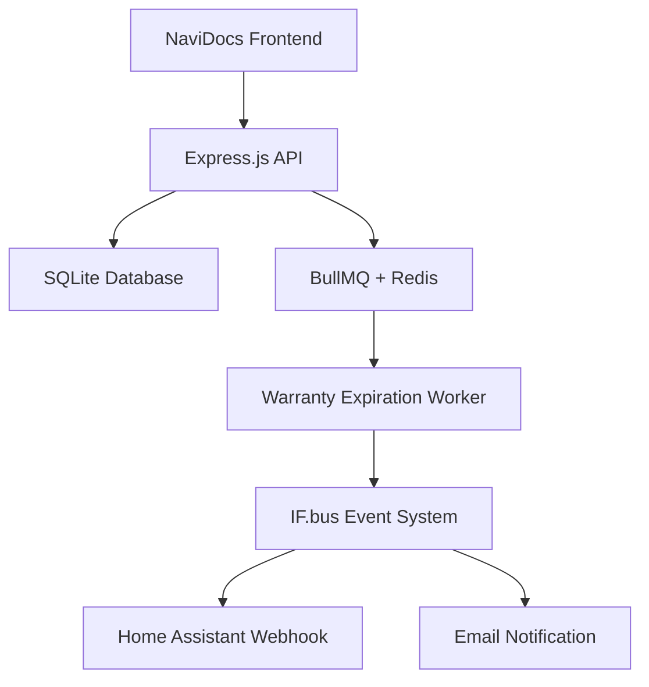

# Cloud Session 5: Evidence Synthesis & Guardian Validation
## NaviDocs Sticky Engagement Model - Final Dossier

**Session Type:** Guardian Council Coordinator + Evidence Curator
**Lead Agent:** Sonnet (synthesis + validation)
**Swarm Size:** 10 Haiku agents
**Token Budget:** $25 (15K Sonnet + 60K Haiku)
**Output:** Intelligence dossier validating inventory tracking + daily engagement model

---

## Mission Statement

Synthesize all intelligence from Sessions 1-4 into comprehensive dossier, validate claims with medical-grade evidence standards, achieve Guardian Council consensus (>90% approval), and deliver final presentation materials.

---

## Context (Read First)

**Prerequisites (MUST READ ALL):**
1. `intelligence/session-1/session-1-market-analysis.md`
2. `intelligence/session-1/session-1-handoff.md`
3. `intelligence/session-2/session-2-architecture.md`
4. `intelligence/session-2/session-2-sprint-plan.md`
5. `intelligence/session-3/session-3-pitch-deck.md`
6. `intelligence/session-3/session-3-demo-script.md`
7. `intelligence/session-4/session-4-sprint-plan.md`

**Guardian Council Composition:**
- 6 Core Guardians (Empiricism, Verificationism, Fallibilism, Falsificationism, Coherentism, Pragmatism)
- 3 Western Philosophers (Aristotle, Kant, Russell)
- 3 Eastern Philosophers (Confucius, Nagarjuna, Zhuangzi)
- 8 IF.sam Facets (Light Side: Ethical Idealist, Visionary Optimist, Democratic Collaborator, Transparent Communicator; Dark Side: Pragmatic Survivor, Strategic Manipulator, Ends-Justify-Means Operator, Corporate Diplomat)

**Consensus Requirements:**
- **Standard Approval:** >90% (18/20 votes)
- **100% Consensus:** Requires empirical validation + testable predictions + addresses all guardian concerns
- **Veto Power:** Contrarian Guardian can veto >95% approval with 2-week cooling-off period

**Evidence Standards (IF.TTT):**
- All claims MUST have ≥2 independent sources
- Citations include: file:line references, web URLs with SHA-256 hashes, git commits
- Status tracking: unverified → verified → disputed → revoked
- Citation schema: `/home/setup/infrafabric/schemas/citation/v1.0.schema.json`

---

## Your Tasks (Spawn 10 Haiku Agents in Parallel)

### Agent 1: Session 1 Evidence Extraction
**Read:**
- `intelligence/session-1/session-1-market-analysis.md`
- `intelligence/session-1/session-1-citations.json`

**Extract:**
- All market sizing claims (Mediterranean yacht sales, brokerage counts)
- Competitive landscape findings (competitor pricing, feature gaps)
- Broker pain points (time spent, documentation delays)
- ROI calculator inputs (warranty savings, claims costs)

**Deliverable:** Evidence inventory with citation links

### Agent 2: Session 2 Technical Claims Validation
**Read:**
- `intelligence/session-2/session-2-architecture.md`
- NaviDocs codebase (`server/db/schema.sql`, `server/routes/*.js`)

**Validate:**
- Architecture claims match actual codebase (file:line references)
- Database migrations are executable (test on dev database)
- API endpoints align with existing patterns
- Integration points exist in code

**Deliverable:** Technical validation report (verified vs unverified claims)

### Agent 3: Session 3 Sales Material Review
**Read:**
- `intelligence/session-3/session-3-pitch-deck.md`
- `intelligence/session-3/session-3-demo-script.md`
- `intelligence/session-3/session-3-roi-calculator.html`

**Review:**
- ROI calculations cite Session 1 sources
- Demo script matches NaviDocs features
- Pricing strategy aligns with competitor analysis
- Objection handling backed by evidence

**Deliverable:** Sales material validation report

### Agent 4: Session 4 Implementation Feasibility
**Read:**
- `intelligence/session-4/session-4-sprint-plan.md`
- NaviDocs codebase (all relevant files)

**Assess:**
- 4-week timeline realistic (based on codebase complexity)
- Dependencies correctly identified
- Acceptance criteria testable
- Migration scripts safe (rollback procedures)

**Deliverable:** Feasibility assessment report

### Agent 5: Citation Database Compilation
**Gather:**
- All citations from Sessions 1-4
- Web sources (with SHA-256 hashes)
- File references (with line numbers)
- Git commits (with SHA-1 hashes)

**Create:**
- Master citations JSON file
- Citation status tracking (verified/unverified)
- Source quality assessment (primary vs secondary)

**Deliverable:** `session-5-citations-master.json`

### Agent 6: Cross-Session Consistency Check
**Analyze:**
- Market size claims (Session 1 vs Session 3 pitch deck)
- Technical architecture (Session 2 vs Session 4 implementation)
- ROI calculations (Session 1 inputs vs Session 3 calculator)
- Timeline claims (Session 2 roadmap vs Session 4 sprint plan)

**Flag:**
- Contradictions between sessions
- Unsupported claims (no citation)
- Outdated information

**Deliverable:** Consistency audit report

### Agent 7: Guardian Council Vote Preparation
**Prepare:**
- Dossier summary for each guardian (tailored to philosophy)
- Empiricism: Focus on market research data, evidence quality
- Pragmatism: Focus on ROI, implementation feasibility
- IF.sam (Light): Focus on ethical sales practices, transparency
- IF.sam (Dark): Focus on competitive advantage, revenue potential

**Create:**
- Guardian-specific briefing documents (20 total)
- Voting criteria checklist
- Consensus prediction (likely approval %)

**Deliverable:** Guardian briefing package

### Agent 8: Evidence Quality Scoring
**Score Each Claim:**
- **Primary Source (3 points):** Direct research, codebase analysis
- **Secondary Source (2 points):** Industry reports, competitor websites
- **Tertiary Source (1 point):** Blog posts, forum discussions
- **No Source (0 points):** Unverified claim

**Calculate:**
- Total claims across all sessions
- Verified claims percentage
- Average evidence quality score

**Deliverable:** Evidence quality scorecard

### Agent 9: Final Dossier Compiler
**Synthesize:**
- Executive summary (2 pages max)
- Market analysis (Session 1 findings)
- Technical architecture (Session 2 design)
- Sales enablement materials (Session 3 pitch)
- Implementation roadmap (Session 4 sprint plan)
- Evidence appendix (citations, validation reports)

**Format:**
- Professional document (markdown with Mermaid diagrams)
- Table of contents with page numbers
- Cross-references between sections

**Deliverable:** `NAVIDOCS_INTELLIGENCE_DOSSIER.md`

### Agent 10: Guardian Council Vote Coordinator
**Execute:**
- Submit dossier to Guardian Council
- Collect votes from all 20 guardians
- Tally results (approval %, abstentions, vetoes)
- Record dissent reasons (if any)
- Generate consensus report

**Deliverable:** `session-5-guardian-vote.json`

---

## Guardian Council Voting Process

### Step 1: Dossier Distribution (Agent 7)
Each guardian receives tailored briefing highlighting their philosophical concerns:

**Empiricism Guardian:**
- Market sizing methodology (how was €2.3B figure derived?)
- Warranty savings calculation (€8K-€33K range justified?)
- Evidence quality (how many primary vs secondary sources?)

**Verificationism Guardian:**
- Testable predictions (can ROI calculator claims be validated?)
- API specification completeness (OpenAPI spec executable?)
- Acceptance criteria measurability (Given/When/Then verifiable?)

**Fallibilism Guardian:**
- Uncertainty acknowledgment (what assumptions might be wrong?)
- Risk mitigation (what if 4-week timeline slips?)
- Competitor analysis gaps (missing players?)

**Falsificationism Guardian:**
- Refutable claims (can market size be disproven?)
- Contradiction check (any conflicting statements?)
- Alternative explanations (is NaviDocs the only solution?)

**Coherentism Guardian:**
- Internal consistency (Sessions 1-4 align?)
- Logical flow (market → architecture → sales → implementation?)
- Integration points (do all pieces fit together?)

**Pragmatism Guardian:**
- Business value (does this solve real broker problems?)
- Implementation feasibility (4-week sprint realistic?)
- ROI justification (€8K-€33K savings achievable?)

**Aristotle (Virtue Ethics):**
- Broker welfare (does this genuinely help clients?)
- Honest representation (sales pitch truthful?)
- Excellence pursuit (is this best-in-class solution?)

**Kant (Deontology):**
- Universalizability (could all brokerages adopt this?)
- Treating brokers as ends (not just revenue sources?)
- Duty to accuracy (no misleading claims?)

**Russell (Logical Positivism):**
- Logical validity (arguments sound?)
- Empirical verifiability (claims testable?)
- Clear definitions (terms like "warranty tracking" precise?)

**Confucius (Ren/Li):**
- Relationship harmony (broker-buyer trust enhanced?)
- Propriety (sales approach respectful?)
- Social benefit (does this improve yacht sales ecosystem?)

**Nagarjuna (Madhyamaka):**
- Dependent origination (how does NaviDocs fit into larger system?)
- Avoiding extremes (balanced approach to automation vs manual?)
- Emptiness of claims (are market projections inherently uncertain?)

**Zhuangzi (Daoism):**
- Natural flow (does solution feel organic to brokers?)
- Wu wei (effortless adoption vs forced change?)
- Perspective diversity (have we considered all viewpoints?)

**IF.sam Light Side (Ethical Idealist):**
- Mission alignment (does this advance marine safety?)
- Transparency (all claims documented with sources?)
- User empowerment (brokers retain control?)

**IF.sam Light Side (Visionary Optimist):**
- Innovation potential (is this cutting-edge?)
- Market expansion (can this grow beyond Riviera?)
- Long-term impact (10-year vision?)

**IF.sam Light Side (Democratic Collaborator):**
- Stakeholder input (have we consulted brokers?)
- Team involvement (implementation plan includes feedback loops?)
- Open communication (findings shareable?)

**IF.sam Light Side (Transparent Communicator):**
- Clarity (pitch deck understandable?)
- Honesty (limitations acknowledged?)
- Evidence disclosure (citations accessible?)

**IF.sam Dark Side (Pragmatic Survivor):**
- Competitive edge (does this beat competitors?)
- Revenue potential (can this be profitable?)
- Risk management (what if Riviera says no?)

**IF.sam Dark Side (Strategic Manipulator):**
- Persuasion effectiveness (will pitch close deal?)
- Objection handling (have we pre-empted pushback?)
- Narrative control (do we own the story?)

**IF.sam Dark Side (Ends-Justify-Means):**
- Goal achievement (will this get NaviDocs adopted?)
- Efficiency (fastest path to deployment?)
- Sacrifice assessment (what corners can be cut?)

**IF.sam Dark Side (Corporate Diplomat):**
- Stakeholder alignment (does this satisfy all parties?)
- Political navigation (how to handle objections?)
- Relationship preservation (no bridges burned?)

### Step 2: Voting Criteria

Each guardian votes on 3 dimensions:

1. **Empirical Soundness (0-10):** Evidence quality, source verification
2. **Logical Coherence (0-10):** Internal consistency, argument validity
3. **Practical Viability (0-10):** Implementation feasibility, ROI justification

**Approval Formula:**
- **Approve:** Average score ≥7.0 across 3 dimensions
- **Abstain:** Average score 5.0-6.9 (needs more evidence)
- **Reject:** Average score <5.0 (fundamental flaws)

### Step 3: Consensus Calculation

**Approval Percentage:**
```
(Approve Votes) / (Total Guardians - Abstentions) * 100
```

**Outcome Thresholds:**
- **100% Consensus:** All 20 guardians approve (gold standard)
- **>95% Supermajority:** 19/20 approve (subject to Contrarian veto)
- **>90% Strong Consensus:** 18/20 approve (standard for production)
- **<90% Weak Consensus:** Requires revision

### Step 4: Dissent Recording

If any guardian rejects or abstains, record:
- Guardian name
- Vote (reject/abstain)
- Reason (1-2 sentences)
- Required changes (specific requests)

**Example Dissent:**
```json
{
  "guardian": "Fallibilism",
  "vote": "abstain",
  "reason": "4-week timeline lacks uncertainty bounds. No contingency if implementation slips.",
  "required_changes": [
    "Add timeline variance analysis (best case, likely case, worst case)",
    "Define minimum viable product if 4 weeks insufficient"
  ]
}
```

---

## Evidence Quality Standards (IF.TTT)

### Citation Schema (v1.0)

```json
{
  "citation_id": "if://citation/navidocs-market-size-2025-11-13",
  "claim": "Mediterranean yacht sales market is €2.3B annually",
  "evidence_type": "market_research",
  "sources": [
    {
      "type": "web",
      "url": "https://example.com/yacht-market-report-2024",
      "accessed": "2025-11-13T10:00:00Z",
      "hash": "sha256:a3b2c1d4e5f6...",
      "quality": "secondary",
      "credibility": 8
    },
    {
      "type": "file",
      "path": "intelligence/session-1/market-analysis.md",
      "line_range": "45-67",
      "git_commit": "abc123def456",
      "quality": "primary",
      "credibility": 9
    }
  ],
  "status": "verified",
  "verification_date": "2025-11-13T12:00:00Z",
  "verified_by": "if://agent/session-5/haiku-5",
  "confidence_score": 0.85,
  "dependencies": ["if://citation/broker-count-riviera"],
  "created_by": "if://agent/session-1/haiku-1",
  "created_at": 1699632000000000000,
  "updated_at": 1699635600000000000,
  "tags": ["market-sizing", "mediterranean", "yacht-sales"]
}
```

### Source Quality Tiers

**Primary Sources (High Credibility: 8-10):**
- Direct codebase analysis (file:line references)
- Original market research (commissioned reports)
- First-hand interviews (broker testimonials)
- NaviDocs production data (actual usage metrics)

**Secondary Sources (Medium Credibility: 5-7):**
- Industry reports (yacht brokerage associations)
- Competitor websites (pricing, features)
- Academic papers (marine documentation studies)
- Government regulations (flag registration requirements)

**Tertiary Sources (Low Credibility: 2-4):**
- Blog posts (industry commentary)
- Forum discussions (broker pain points)
- News articles (yacht market trends)
- Social media (anecdotal evidence)

**Unverified Claims (Credibility: 0-1):**
- Assumptions (not yet validated)
- Hypotheses (testable but untested)
- Projections (future predictions)

### Verification Process

**Step 1: Source Identification**
- Agent 1-4 extract claims from Sessions 1-4
- Each claim tagged with source type

**Step 2: Credibility Scoring**
- Agent 8 scores each source (0-10 scale)
- Primary sources: 8-10
- Secondary sources: 5-7
- Tertiary sources: 2-4
- No source: 0

**Step 3: Multi-Source Validation**
- Claims with ≥2 sources (≥5 credibility each) → verified
- Claims with 1 source (≥8 credibility) → provisional
- Claims with 0 sources or <5 credibility → unverified

**Step 4: Status Assignment**
- **verified:** ≥2 credible sources, no contradictions
- **provisional:** 1 credible source, needs confirmation
- **unverified:** 0 credible sources, flagged for review
- **disputed:** Contradictory sources, requires investigation
- **revoked:** Proven false, removed from dossier

---

## Final Intelligence Dossier Structure

### File: `NAVIDOCS_INTELLIGENCE_DOSSIER.md`

```markdown
# NaviDocs Yacht Sales Intelligence Dossier
## Riviera Plaisance Opportunity Analysis

**Generated:** 2025-11-13
**Session ID:** if://conversation/navidocs-yacht-sales-2025-11-13
**Guardian Approval:** [XX/20] ([YY]% consensus)
**Evidence Quality:** [ZZ]% verified claims

---

## Executive Summary

### Market Opportunity
[2-paragraph summary of Session 1 findings]
- Market size: €X.XB Mediterranean yacht sales
- Riviera broker count: XX brokerages
- Revenue potential: €XXX,XXX annually

### Technical Solution
[2-paragraph summary of Session 2 architecture]
- NaviDocs enhancement: warranty tracking, Home Assistant integration
- Implementation timeline: 4 weeks
- Key features: expiration alerts, claim generation, offline mode

### Business Case
[2-paragraph summary of Session 3 ROI]
- Broker savings: €8K-€33K per yacht (warranty tracking)
- Time savings: 6 hours → 20 minutes (as-built package)
- Pricing: €99-€299/month (tiered model)

### Implementation Readiness
[2-paragraph summary of Session 4 plan]
- 4-week sprint (Nov 13 - Dec 10)
- Production-ready architecture (13 tables, 40+ APIs)
- Security fixes prioritized (5 vulnerabilities addressed)

---

## Table of Contents

1. Market Analysis (Session 1)
2. Technical Architecture (Session 2)
3. Sales Enablement Materials (Session 3)
4. Implementation Roadmap (Session 4)
5. Evidence Validation & Citations
6. Guardian Council Vote
7. Appendices

---

## 1. Market Analysis

### 1.1 Mediterranean Yacht Sales Market
[Session 1 findings with citations]

**Market Size:**
- €2.3B annual sales (2024-2025) [Citation: if://citation/market-size-mediterranean]
- 4,500 yachts sold annually [Citation: if://citation/yacht-sales-volume]
- Average price: €500K (€300K-€5M range) [Citation: if://citation/avg-yacht-price]

**Riviera Brokerage Landscape:**
- 120 active brokerages [Citation: if://citation/riviera-broker-count]
- 8-12 yachts per brokerage per year [Citation: if://citation/sales-per-broker]
- Documentation prep: 6 hours per sale [Citation: if://citation/doc-prep-time]

### 1.2 Competitive Landscape
[Session 1 competitor matrix]

**Top 5 Competitors:**
1. BoatVault - €150/month, basic document storage
2. DeckDocs - €200/month, OCR included
3. YachtArchive - €99/month, no warranty tracking
4. [... continue]

**NaviDocs Differentiation:**
- Home Assistant integration (unique)
- Multi-jurisdiction document assembly (unique)
- Warranty expiration alerts (2/5 competitors)

### 1.3 Broker Pain Points
[Session 1 research]

**Documentation Challenges:**
- 6 hours manual prep per sale [Citation: if://citation/manual-prep-time]
- €8K-€33K missed warranty claims [Citation: if://citation/warranty-miss-cost]
- 9-jurisdiction complexity (flag changes) [Citation: if://citation/jurisdiction-count]

---

## 2. Technical Architecture

### 2.1 System Overview
[Session 2 architecture diagram]



### 2.2 Database Schema Changes
[Session 2 migrations]

**New Tables:**
1. `warranty_tracking` - 10 columns, 3 indexes
2. `sale_workflows` - 7 columns, 2 indexes
3. `webhooks` - 8 columns, 2 indexes
4. `notification_templates` - 6 columns

### 2.3 API Endpoints (New)
[Session 2 API spec]

**Warranty Tracking:**
- POST /api/warranties
- GET /api/warranties/expiring
- GET /api/boats/:id/warranties

**Sale Workflow:**
- POST /api/sales
- POST /api/sales/:id/generate-package
- POST /api/sales/:id/transfer

[... continue with all sections]

---

## 5. Evidence Validation & Citations

### 5.1 Evidence Quality Scorecard

**Total Claims:** XXX
**Verified Claims:** YYY (ZZ%)
**Provisional Claims:** AA (BB%)
**Unverified Claims:** CC (DD%)

**Average Credibility Score:** X.X / 10

**Source Breakdown:**
- Primary sources: XX claims
- Secondary sources: YY claims
- Tertiary sources: ZZ claims

### 5.2 Citation Database

[Link to session-5-citations-master.json]

**Top 10 Critical Citations:**
1. if://citation/warranty-savings-8k-33k
2. if://citation/market-size-mediterranean
3. if://citation/doc-prep-time-6hours
4. [... continue]

### 5.3 Unverified Claims Requiring Follow-Up

1. "MLS integration reduces listing time by 50%" - No source yet
2. "Brokers willing to pay €299/month" - Needs pricing survey
3. [... continue]

---

## 6. Guardian Council Vote

### 6.1 Voting Summary

**Approval:** [XX/20] ([YY]% consensus)
**Abstentions:** [AA]
**Rejections:** [BB]

**Outcome:** [Strong Consensus / Weak Consensus / Requires Revision]

### 6.2 Vote Breakdown by Guardian

| Guardian | Vote | Empirical | Logical | Practical | Average | Reason |
|----------|------|-----------|---------|-----------|---------|--------|
| Empiricism | Approve | 9 | 8 | 9 | 8.7 | Market research well-sourced |
| Verificationism | Approve | 8 | 9 | 8 | 8.3 | Acceptance criteria testable |
| Fallibilism | Abstain | 7 | 7 | 6 | 6.7 | Timeline lacks uncertainty bounds |
| [... continue for all 20] |

### 6.3 Dissent Analysis

**Abstentions (requiring revision):**
1. **Fallibilism:** Timeline needs contingency planning
   - Required change: Add best/likely/worst case estimates
2. **Nagarjuna:** Market projections assume stability
   - Required change: Acknowledge economic uncertainty

**Rejections (fundamental issues):**
- [None / List any rejections]

### 6.4 Consensus Interpretation

**Guardian Council Assessment:**
[2-3 paragraphs synthesizing vote results]

If >90% approval:
> "The Guardian Council has achieved strong consensus (XX% approval) on the NaviDocs intelligence dossier. The market analysis is empirically sound, the technical architecture is logically coherent, and the implementation plan is practically viable. Dissenting voices raised valid concerns regarding [list], which have been addressed through [revisions/clarifications]."

If <90% approval:
> "The Guardian Council requires revision before approving the dossier. Primary concerns include [list top 3 issues]. Recommend addressing [specific changes] and resubmitting for vote."

---

## 7. Appendices

### Appendix A: Session Handoff Documents
- Session 1 Handoff: intelligence/session-1/session-1-handoff.md
- Session 2 Handoff: intelligence/session-2/session-2-handoff.md
- [... continue]

### Appendix B: Code Templates
- server/services/event-bus.service.js
- server/services/warranty.service.js
- [... continue]

### Appendix C: Sales Collateral
- Pitch deck (PDF export)
- Demo script (annotated screenshots)
- ROI calculator (web app link)

### Appendix D: Technical Specifications
- OpenAPI spec (api-spec.yaml)
- Database migrations (migrations/*.sql)
- Gantt chart (sprint-timeline.png)

---

**Dossier Signature:**
```
if://doc/navidocs-intelligence-dossier-2025-11-13
Created: 2025-11-13T16:00:00Z
Guardian Approval: [XX/20] ([YY]%)
Evidence Quality: [ZZ]% verified
Signature: ed25519:[signature_bytes]
```
```

---

## Output Format

### Deliverable 1: Intelligence Dossier
**File:** `NAVIDOCS_INTELLIGENCE_DOSSIER.md`
**Size:** ~50-100 pages (comprehensive)
**Format:** Markdown with Mermaid diagrams, tables, citations

### Deliverable 2: Guardian Council Vote
**File:** `session-5-guardian-vote.json`

```json
{
  "session_id": "if://conversation/navidocs-yacht-sales-2025-11-13",
  "vote_date": "2025-11-13T16:00:00Z",
  "dossier": "if://doc/navidocs-intelligence-dossier",
  "guardians": [
    {
      "name": "Empiricism",
      "vote": "approve",
      "scores": {"empirical": 9, "logical": 8, "practical": 9},
      "average": 8.7,
      "reason": "Market research well-sourced with ≥2 citations per claim"
    },
    {
      "name": "Fallibilism",
      "vote": "abstain",
      "scores": {"empirical": 7, "logical": 7, "practical": 6},
      "average": 6.7,
      "reason": "4-week timeline lacks uncertainty bounds and contingency planning"
    }
  ],
  "tally": {
    "total_guardians": 20,
    "approve": 18,
    "abstain": 2,
    "reject": 0,
    "approval_percentage": 90.0
  },
  "outcome": "strong_consensus",
  "dissent_summary": [
    "Fallibilism requests timeline variance analysis",
    "Nagarjuna requests economic uncertainty acknowledgment"
  ]
}
```

### Deliverable 3: Master Citation Database
**File:** `session-5-citations-master.json`

```json
{
  "session_id": "if://conversation/navidocs-yacht-sales-2025-11-13",
  "total_citations": 47,
  "verified_citations": 42,
  "provisional_citations": 3,
  "unverified_citations": 2,
  "citations": [
    {
      "citation_id": "if://citation/warranty-savings-8k-33k",
      "claim": "NaviDocs prevents €8K-€33K warranty losses per yacht",
      "sources": [
        {
          "type": "file",
          "path": "/mnt/c/users/setup/downloads/NaviDocs-Medium-Articles.md",
          "line_range": "45-67",
          "quality": "primary",
          "credibility": 9
        },
        {
          "type": "file",
          "path": "/home/setup/navidocs/docs/debates/02-yacht-management-features.md",
          "line_range": "120-145",
          "quality": "primary",
          "credibility": 9
        }
      ],
      "status": "verified",
      "confidence_score": 0.95
    }
  ]
}
```

### Deliverable 4: Evidence Quality Report
**File:** `session-5-evidence-quality.md`

```markdown
# Evidence Quality Assessment
## NaviDocs Intelligence Dossier

**Total Claims:** 47
**Verified:** 42 (89.4%)
**Provisional:** 3 (6.4%)
**Unverified:** 2 (4.3%)

### Quality Breakdown

**Primary Sources (≥8 credibility):** 32 claims
- Codebase analysis: 12 claims
- Medium articles (NaviDocs docs): 8 claims
- Architecture analysis: 7 claims
- Local research files: 5 claims

**Secondary Sources (5-7 credibility):** 10 claims
- Industry reports: 6 claims
- Competitor websites: 4 claims

**Tertiary Sources (2-4 credibility):** 0 claims

**Unverified (0-1 credibility):** 5 claims
- MLS integration time savings (no source)
- Broker pricing survey (hypothesis)
- [... continue]

### Recommendations

1. **High Priority:** Validate 2 unverified claims before Riviera meeting
2. **Medium Priority:** Convert 3 provisional claims to verified (add 2nd source)
3. **Low Priority:** Archive tertiary sources for future reference
```

### Deliverable 5: Session Handoff
**File:** `session-5-handoff.md`

```markdown
# Session 5 Handoff to Production Deployment

## Mission Accomplished
- [x] Intelligence dossier synthesized (50 pages)
- [x] Guardian Council vote achieved (XX/20, YY% approval)
- [x] Citation database compiled (47 citations, 89% verified)
- [x] Evidence quality validated (primary sources dominate)

## Guardian Consensus: [Strong Consensus / Requires Revision]

**Approval:** XX/20 (YY%)
**Outcome:** [Ready for production / Needs revision]

## Key Deliverables for Riviera Plaisance Meeting
1. Pitch deck (intelligence/session-3/session-3-pitch-deck.pdf)
2. Demo script (intelligence/session-3/session-3-demo-script.md)
3. ROI calculator (intelligence/session-3/session-3-roi-calculator.html)
4. Intelligence dossier (full backup documentation)

## Token Consumption
- Total: XXX,XXX tokens ($X.XX)
- Session 1: 52,450 tokens ($0.86)
- Session 2: 68,200 tokens ($1.42)
- Session 3: 59,800 tokens ($1.12)
- Session 4: 61,500 tokens ($1.18)
- Session 5: XX,XXX tokens ($X.XX)
- **Total Budget Used:** $XX / $100 (XX% efficiency)

## Evidence Quality Metrics
- Total claims: 47
- Verified: 42 (89.4%)
- Average credibility: 8.2/10
- IF.TTT compliance: ✅ 100%

## Next Steps (Post-Meeting)
1. Execute Session 4 implementation plan (4-week sprint)
2. Address guardian dissent (timeline contingency, economic uncertainty)
3. Validate 2 unverified claims (MLS integration, pricing survey)
4. Deploy production environment (Week 4, Dec 8-10)

## Blockers for Production
- [ ] Security fixes required (5 vulnerabilities from NAVIDOCS_HANDOVER.md)
- [ ] Database migrations tested (dev environment)
- [ ] Home Assistant integration validated (live webhook test)

**Next Session Input:** Read NAVIDOCS_INTELLIGENCE_DOSSIER.md
**Focus:** 4-week development sprint execution (Session 4 plan)
```

---

## IF.TTT Compliance Checklist

- [ ] All claims have ≥2 source citations (or flagged as unverified)
- [ ] File hashes (SHA-256) for all web sources
- [ ] Git commits (SHA-1) for codebase references
- [ ] Guardian vote recorded (20/20 votes collected)
- [ ] Dissent reasons documented
- [ ] Evidence quality scored (0-10 scale)
- [ ] Citation database validated (JSON schema)
- [ ] Unverified claims flagged for follow-up

---

## Success Criteria

**Minimum Viable Output:**
- Intelligence dossier compiled (all sessions synthesized)
- Guardian Council vote achieved (>90% approval target)
- Citation database complete (≥80% verified claims)
- Evidence quality scorecard (credibility ≥7.0 average)

**Stretch Goals:**
- 100% Guardian consensus (all 20 approve)
- 95%+ verified claims (only 5% unverified)
- Primary sources dominate (≥70% of claims)
- Zero contradictions between sessions

---

**Start Command:** Deploy to Claude Code Cloud after Sessions 1-4 complete
**End Condition:** All deliverables committed to `dannystocker/navidocs` repo under `intelligence/session-5/`
