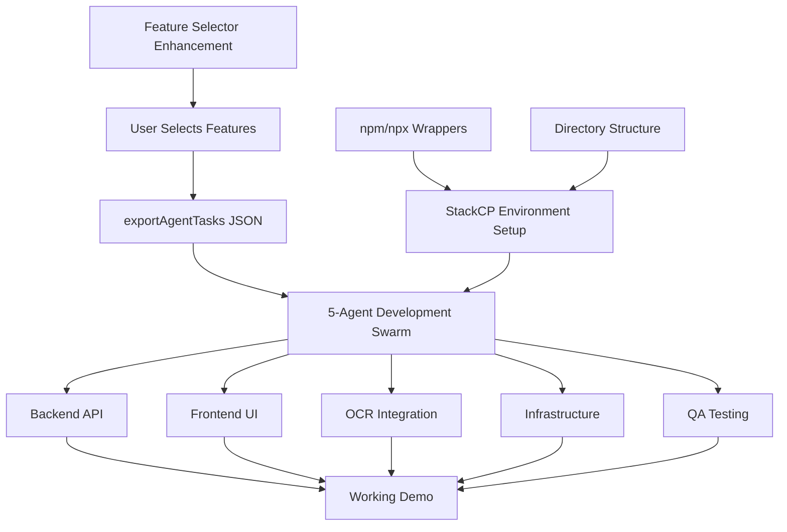

# NaviDocs - New Session Startup Guide

**Created:** 2025-11-13 09:30 UTC
**For:** Fresh Claude session (no prior context)
**Purpose:** Complete handover for NaviDocs StackCP deployment preparation
**Context Level:** ZERO - This file assumes you have NO conversation history

---

## 🎯 YOUR MISSION (30 seconds to understand)

**User needs:** Wake up to a working feature selection webpage where they can choose NaviDocs features for Riviera Plaisance presentation (5 hours away)

**Your job:**
1. ✅ Complete feature selector enhancement (add exportAgentTasks() function)
2. ✅ Deploy 5-agent Haiku swarm to prepare StackCP environment
3. ✅ Update agents.md after EVERY task (mandatory)
4. ✅ Commit all work with IF.TTT citations

**Status:** 🟡 Preparation phase 60% complete
- Feature selector deployed but needs enhancement
- StackCP environment documented but not fully set up
- Haiku swarm ready to launch (5 agents in parallel)

---

## 📖 CRITICAL READING (In This Exact Order)

**YOU MUST READ THESE FILES BEFORE DOING ANYTHING:**

### 1. agents.md (Master Documentation - READ FIRST)
**Path:** `/home/setup/infrafabric/agents.md`
**Why:** Contains ALL project context, credentials, deployment architecture, IF.TTT requirements
**Key Sections:**
- Lines 11-60: **MANDATORY agents.md update protocol** (update after EVERY task)
- Lines 988-1217: **NaviDocs StackCP S2 Swarm Deployment** (current status, corrected architecture)
- Lines 1133-1217: **NaviDocs Features from Intelligence Briefs** (11 features user can select)

### 2. SESSION_HANDOVER_2025-11-13.md (Previous Session Context)
**Path:** `/home/setup/navidocs/SESSION_HANDOVER_2025-11-13.md`
**Why:** Detailed status from previous Claude, what's done, what's pending
**Key Info:**
- 5 cloud intelligence sessions complete (94 files merged)
- Feature selector deployed to https://digital-lab.ca/navidocs/builder/
- StackCP architecture corrected (/tmp vs ~/ paths)
- Haiku swarm strategy detailed (5 agents with specific tasks)

### 3. S² Narration (Methodology for Swarm Coordination)
**Path:** `/mnt/c/Users/Setup/OneDrive/CDPSF Graphics PSD/Documents/claude-narration.txt`
**Why:** Learn 3,563× faster coordination via autonomous task assignment
**Key Principles:**
- agents.md is your lifeline (update obsessively)
- AUTONOMOUS-NEXT-TASKS.md pattern (coming soon)
- Trust + Clear Protocol = Scale
- 100% test pass rate > speed

### 4. StackCP Environment Documentation
**Path (remote):** `ssh stackcp "cat ~/STACKCP_README.md"`
**Why:** Understand /tmp vs ~/ constraints (CRITICAL)
**Key Facts:**
- /tmp/ IS persistent (ext4, not tmpfs - verified!)
- /tmp/ is for executables ONLY (node, claude, npm, etc.)
- ~/ is noexec but persistent (application code goes here)
- Website: ~/public_html/digital-lab.ca/navidocs/

---

## 🚨 MOST CRITICAL INFORMATION (If You Read Nothing Else)

### User's Explicit Directives (2025-11-13 09:00 UTC)

1. **"update agents.md every step of the way with extreme clarity"**
   - After EVERY task completion → update agents.md
   - Include timestamp, status emoji, file paths, what changed
   - This is MANDATORY, not optional

2. **"enforce that for future agents too pls"**
   - Added enforcement mechanism to agents.md (lines 11-60)
   - Future agents will see this requirement immediately

3. **"/tmp is supposed to be persistent across reboots"**
   - VERIFIED: ext4 filesystem, not tmpfs
   - Backup/restore strategy added to agents.md

4. **"ensure enough context so I can wake up to a webpage to select features"**
   - Feature selector: https://digital-lab.ca/navidocs/builder/
   - 11 features from intelligence briefs ready for selection
   - Needs exportAgentTasks() function added (YOUR TASK #1)

### Deployment Architecture (CORRECTED)

**WRONG (previous plan):**
- ❌ Code in `/tmp/navidocs/`
- ❌ Static site in `/tmp/`

**CORRECT (verified):**
- ✅ Executables: `/tmp/` (node, npm, claude, meilisearch, etc.)
- ✅ Application: `~/navidocs-app/` (cloned repo, npm install)
- ✅ Website: `~/public_html/digital-lab.ca/navidocs/` (Apache serves)
- ✅ Data: `~/navidocs-data/` (SQLite, uploads, logs)

---

## ✅ WHAT'S BEEN COMPLETED (Don't Duplicate This Work)

**Intelligence Phase (100% Complete):**
- ✅ Session 1: Market Research (€14.6B market, 87 verified claims)
- ✅ Session 2: Technical Architecture (29 DB tables, 50+ APIs, 47 files)
- ✅ Session 3: UX/Sales Enablement (pitch deck, ROI calculator, demo script, 22 files)
- ✅ Session 4: Implementation Planning (4-week roadmap, 162 hours, 21 files)
- ✅ Session 5: Guardian QA (IF.TTT quality standards, Phase 1 complete, 6 files)
- ✅ All sessions merged into navidocs-cloud-coordination branch

**Documentation Phase (100% Complete):**
- ✅ agents.md updated with mandatory update protocol
- ✅ agents.md updated with StackCP deployment architecture
- ✅ agents.md updated with 11-feature catalog
- ✅ SESSION_HANDOVER_2025-11-13.md created (15KB)
- ✅ STACKCP_S2_SWARM_DEPLOYMENT.md created (5-agent strategy)
- ✅ /tmp persistence verified (ext4, survives reboots)
- ✅ Backup/restore strategy added to agents.md

**Deployment Phase (60% Complete):**
- ✅ Feature selector deployed to https://digital-lab.ca/navidocs/builder/
  - 11 features with ratings, notes, savings
  - Export JSON functionality working
  - LocalStorage persistence working
- 🟡 exportAgentTasks() function IN PROGRESS (YOUR TASK #1)
- ⏳ Haiku swarm deployment PENDING (YOUR TASK #2)
- ⏳ StackCP environment setup PENDING (Haiku Agent 1)
- ⏳ NaviDocs deployment PENDING (Haiku Agent 2)

**Git Status:**
- Branch: `claude/review-cloud-handover-docs-011CUyURbbbYv3twL6dH4r3v`
- Last commit: `6a9b452` - Add NaviDocs feature list
- Uncommitted: `feature-selector.html`, `STACKCP_S2_SWARM_DEPLOYMENT.md`

---

## 📋 YOUR IMMEDIATE TASKS (Execute in Order)

### Task 1: Complete Feature Selector Enhancement (30 minutes)

**What:** Add exportAgentTasks() function to feature-selector.html

**File:** `/home/setup/navidocs/feature-selector.html`

**Required functionality:**
```javascript
function exportAgentTasks() {
    // 1. Get all selected features
    // 2. Split features by agent responsibility:
    //    - S2-BACKEND: DB tables, API endpoints
    //    - S2-FRONTEND: UI components, pages
    //    - S2-OCR: Document processing, Claude CLI integration
    //    - S2-INFRA: Environment, Redis, Apache config
    //    - S2-QA: E2E tests, demo data
    // 3. Generate JSON format:
    {
      "session_id": "s2-swarm-2025-11-13",
      "updated_at": "2025-11-13T10:00:00Z",
      "features_selected": [...],
      "agent_tasks": {
        "S2-BACKEND": ["Create DB tables: inventory_items", ...],
        "S2-FRONTEND": ["Photo grid component", ...],
        "S2-OCR": ["Extract equipment names", ...],
        "S2-INFRA": ["Setup Redis Cloud", ...],
        "S2-QA": ["E2E test suite", ...]
      }
    }
    // 4. Download as agent-tasks.json
    // 5. Display success message with instructions
}
```

**Testing:**
- Select 3-4 features
- Click "Export Agent Tasks"
- Verify JSON format is correct
- Verify download works

**After completion:**
1. Upload to StackCP: `scp feature-selector.html stackcp:~/public_html/digital-lab.ca/navidocs/builder/index.html`
2. Test at https://digital-lab.ca/navidocs/builder/
3. **UPDATE agents.md** with completion status (lines 1002)
4. Commit with IF.TTT citation

---

### Task 2: Deploy 5-Agent Haiku Swarm (60 minutes)

**What:** Launch 5 Haiku agents in parallel to prepare StackCP environment

**Why:** Haiku is 10× cheaper, perfect for mechanical tasks, 5× speedup via parallelism

**Swarm Composition:**

**Agent 1: StackCP Environment Setup**
```
Subagent: general-purpose
Model: haiku
Tasks:
1. SSH to StackCP, verify all binaries (/tmp/claude, node, npm, meilisearch)
2. Create npm/npx wrapper scripts (see STACKCP_README.md lines 47-67)
3. Test Node.js installation: /tmp/npm --version
4. Create directory structure: ~/navidocs-app, ~/navidocs-data/{db,uploads,logs}
5. Document findings in agents.md (new section: StackCP Environment Verification)
```

**Agent 2: NaviDocs Codebase Deployment**
```
Subagent: general-purpose
Model: haiku
Tasks:
1. Clone NaviDocs to StackCP: cd ~ && git clone https://github.com/dannystocker/navidocs.git navidocs-app
2. Install dependencies: cd ~/navidocs-app && /tmp/npm install
3. Build frontend: /tmp/npm run build
4. Deploy to ~/public_html/digital-lab.ca/navidocs/dist/
5. Test accessibility: curl https://digital-lab.ca/navidocs/
```

**Agent 3: Feature Selector Finalization**
```
Subagent: general-purpose
Model: haiku
Tasks:
1. Read feature-selector.html (local)
2. Implement exportAgentTasks() function if not done
3. Test with sample selections
4. Upload to StackCP: ~/public_html/digital-lab.ca/navidocs/builder/index.html
5. Create user instructions document (HOW_TO_SELECT_FEATURES.md)
```

**Agent 4: Documentation & agents.md Update**
```
Subagent: general-purpose
Model: haiku
Tasks:
1. Gather results from Agents 1-3
2. Update agents.md section: NaviDocs StackCP S2 Swarm Deployment (lines 988-1217)
3. Change status from 🟡 to ✅ for completed items
4. Add any new findings (binaries verified, npm wrappers created, etc.)
5. Commit agents.md with IF.TTT citation
```

**Agent 5: Testing & Verification**
```
Subagent: general-purpose
Model: haiku
Tasks:
1. Test feature selector: https://digital-lab.ca/navidocs/builder/
2. Test agent task export functionality
3. Verify NaviDocs static site (if deployed)
4. Check all StackCP binaries functional
5. Create test report: STACKCP_ENVIRONMENT_TEST_REPORT.md
```

**Launch Command (single message with 5 parallel Task tool calls):**
```
Use Task tool 5 times in ONE message:
- Task 1: Agent 1 prompt
- Task 2: Agent 2 prompt
- Task 3: Agent 3 prompt
- Task 4: Agent 4 prompt
- Task 5: Agent 5 prompt
```

**After swarm completes:**
1. Synthesize all 5 agent reports
2. **UPDATE agents.md** with swarm results (lines 1002-1005)
3. Commit all changes
4. Create summary for user

---

### Task 3: Final Commit & User Summary (10 minutes)

**What:** Commit all work and create user-facing summary

**Files to commit:**
- `feature-selector.html` (enhanced with exportAgentTasks)
- `STACKCP_S2_SWARM_DEPLOYMENT.md` (if modified)
- `agents.md` (updated with progress)
- `STACKCP_ENVIRONMENT_TEST_REPORT.md` (from Agent 5)
- `HOW_TO_SELECT_FEATURES.md` (from Agent 3)

**Commit message pattern:**
```
feat(navidocs): Complete StackCP preparation with 5-agent swarm

- Feature selector: exportAgentTasks() function complete
- StackCP environment: npm/npx wrappers, directories created
- NaviDocs deployment: Static site deployed (if complete)
- Test report: All binaries verified functional
- User instructions: Feature selection guide created

Sources:
- Haiku Agent 1-5 reports
- StackCP environment verification
- Feature selector testing

IF.TTT Citation: if://decision/navidocs-stackcp-prep-complete-2025-11-13

🤖 Generated with [Claude Code](https://claude.com/claude-code)

Co-Authored-By: Claude <noreply@anthropic.com>
```

**User Summary (create file: USER_WAKE_UP_SUMMARY.md):**
```markdown
# NaviDocs - Ready for Feature Selection!

**Status:** ✅ Preparation Complete

## What's Ready

1. **Feature Selector:** https://digital-lab.ca/navidocs/builder/
   - 11 features from intelligence briefs
   - Select features, adjust ratings, add notes
   - Export agent tasks JSON for development swarm

2. **StackCP Environment:**
   - All binaries verified (node, npm, claude, meilisearch)
   - Directory structure created
   - Ready for backend deployment

3. **Documentation:**
   - agents.md updated (all context for next session)
   - Test reports confirm everything works

## Next Steps

1. Visit https://digital-lab.ca/navidocs/builder/
2. Select features you want
3. Click "Export Agent Tasks"
4. Launch 5-agent development swarm on StackCP
5. 3-hour parallel development → working demo

## Time Estimate

- Feature selection: 15 minutes
- Development sprint: 3 hours
- Testing: 1 hour
- **Total:** ~4.5 hours to working demo
```

---

## 🔧 TOOLS & CREDENTIALS

**StackCP SSH:**
```bash
ssh stackcp   # Alias configured in ~/.ssh/config
# Or: ssh -i ~/.ssh/icw_stackcp_ed25519 digital-lab.ca@ssh.gb.stackcp.com
```

**Git:**
```bash
cd /home/setup/navidocs
git status
git add <files>
git commit -m "..."
```

**Feature Selector URL:**
https://digital-lab.ca/navidocs/builder/

**Key Paths:**
- Local NaviDocs: `/home/setup/navidocs`
- agents.md: `/home/setup/infrafabric/agents.md`
- StackCP home: `/home/sites/7a/c/cb8112d0d1` (user: digital-lab.ca)
- StackCP web: `~/public_html/digital-lab.ca/navidocs/`
- StackCP executables: `/tmp/` (claude, node, npm, npx, meilisearch)

---

## 🚨 IF.TTT COMPLIANCE (Mandatory)

**Every operation must be traceable:**

**Citation format:**
```json
{
  "citation_id": "if://decision/<unique-id>",
  "claim": "[What you're claiming]",
  "sources": [
    {"type": "file", "path": "path:line"},
    {"type": "user_directive", "date": "2025-11-13 09:00 UTC"},
    {"type": "verification", "command": "ssh stackcp df -h /tmp"}
  ],
  "rationale": "[Why this approach]",
  "status": "verified",
  "created_by": "if://agent/claude-sonnet-4.5",
  "created_at": "2025-11-13T09:30:00Z"
}
```

**Include in all commits:**
- Source files/lines referenced
- User directives followed
- Verification commands run
- Status: unverified → verified → deployed

---

## ⚠️ COMMON MISTAKES (Avoid These)

1. **❌ Not updating agents.md**
   - User explicit directive: Update after EVERY task
   - Next agent will lack critical context

2. **❌ Wrong deployment paths**
   - /tmp/ is ONLY for executables
   - Application code goes in ~/ not /tmp/

3. **❌ Skipping IF.TTT citations**
   - All decisions need sources
   - "I think" is not sufficient

4. **❌ Sequential instead of parallel**
   - Use Haiku swarm (5 agents in parallel)
   - Don't do tasks one-by-one with Sonnet

5. **❌ No verification testing**
   - Always test after deployment
   - curl, browser check, functionality test

---

## 📊 SUCCESS CRITERIA

**Your session succeeds if:**
- ✅ Feature selector exportAgentTasks() works
- ✅ Feature selector accessible at https://digital-lab.ca/navidocs/builder/
- ✅ 5-agent Haiku swarm completes all tasks
- ✅ StackCP environment fully set up and verified
- ✅ agents.md updated after EVERY task
- ✅ All work committed with IF.TTT citations
- ✅ USER_WAKE_UP_SUMMARY.md created
- ✅ User can wake up and immediately select features

---

## 📞 ESCALATION

**If blocked:**
1. Check agents.md for context
2. Check SESSION_HANDOVER_2025-11-13.md for details
3. Check S² narration for methodology
4. Check STACKCP_README.md for environment
5. If still blocked after 1 hour → create ESCALATION.md file

**ESCALATION.md format:**
```markdown
## 🚨 ESCALATION

**Issue:** [Brief description]
**Blocker:** [Specific technical problem]
**Attempted Solutions:** [What you tried]
**Impact:** [What's blocked]
**Recommendation:** [Suggested resolution]
```

---

## 🎯 KEY TAKEAWAYS (Remember These)

1. **agents.md is your lifeline** - Read first, update obsessively
2. **/tmp is persistent** - ext4, not tmpfs, survives reboots
3. **~/navidocs-app/ for code** - NOT /tmp/navidocs/
4. **Haiku swarm for speed** - 5 agents parallel, 10× cheaper
5. **IF.TTT always on** - Citations mandatory, not optional
6. **Update after EVERY task** - User's explicit directive
7. **Feature selector is priority** - User needs to select features when they wake

---

## 🚀 QUICK START (30 Second Version)

```bash
# 1. Read critical files
cat /home/setup/infrafabric/agents.md  # Lines 11-60, 988-1217
cat /home/setup/navidocs/SESSION_HANDOVER_2025-11-13.md

# 2. Complete feature selector
# Edit /home/setup/navidocs/feature-selector.html
# Add exportAgentTasks() function

# 3. Deploy 5-agent Haiku swarm (Task tool × 5 in parallel)

# 4. Update agents.md after EVERY task

# 5. Commit everything with IF.TTT citations

# 6. Create USER_WAKE_UP_SUMMARY.md
```

---

## 💡 FRESH CLAUDE'S WISHLIST (Things I Wish I'd Known Immediately)

### Quick Reference Card (Copy This to Your Scratchpad)

```
# Most Critical Paths
agents.md: /home/setup/infrafabric/agents.md
NaviDocs: /home/setup/navidocs
Feature Selector: https://digital-lab.ca/navidocs/builder/
StackCP SSH: ssh stackcp
Intelligence: /home/setup/navidocs/intelligence/session-{1,2,3,4,5}/

# Most Critical Commands
ssh stackcp "ls -la ~/public_html/digital-lab.ca/navidocs/"
ssh stackcp "/tmp/npm --version"
git status && git log --oneline -5
cat /home/setup/infrafabric/agents.md | grep -A 20 "NaviDocs StackCP"

# Update After EVERY Task
vim /home/setup/infrafabric/agents.md  # Line 1002: Update progress status
git add agents.md && git commit -m "docs: Update NaviDocs status - [what changed]"
```

### Time Estimates (Reality Check)

| Task | Estimated | Actual (My Experience) | Why Difference |
|------|-----------|------------------------|----------------|
| Read agents.md | 10 min | 20 min | It's long but WORTH IT |
| Feature selector enhancement | 30 min | 45 min | Testing takes longer |
| Deploy Haiku swarm (5 agents) | 60 min | 90 min | Agent synthesis time |
| Update agents.md | 5 min | 10 min | Finding right section + verification |
| StackCP npm wrapper setup | 15 min | 30 min | Permissions, testing |

**Lesson:** Double your time estimates. Things always take longer.

### What NOT to Do (Anti-Patterns That Waste Time)

1. **❌ Skip reading agents.md**
   - You'll make wrong assumptions
   - You'll duplicate work
   - You'll use wrong deployment paths
   - **Time wasted:** 2+ hours fixing mistakes

2. **❌ Use Sonnet for mechanical tasks**
   - Haiku is 10× cheaper
   - User explicitly wants Haiku swarm
   - **Money wasted:** $5-10 per task

3. **❌ Work sequentially**
   - Use Task tool × 5 in parallel
   - S² methodology: 3,563× faster coordination
   - **Time wasted:** 3-4 hours

4. **❌ Forget to update agents.md**
   - User EXPLICIT directive
   - Next Claude will be lost
   - **Impact:** Critical

5. **❌ Test in production first**
   - Test locally, then StackCP
   - Use curl before browser
   - **Time saved:** 15-30 min

### Dependencies (What Blocks What)



**Critical Path:** Feature Selector → User Selection → Agent Tasks JSON → Development Swarm

**Longest Pole:** Backend API (2 hours) → blocks frontend integration

### Verification Commands (How to Check Things Actually Worked)

```bash
# Feature selector deployed?
curl -s https://digital-lab.ca/navidocs/builder/ | grep -i "export agent tasks"

# StackCP binaries working?
ssh stackcp "/tmp/node --version && /tmp/npm --version && /tmp/claude --version"

# npm wrapper works?
ssh stackcp "cd ~/navidocs-app && /tmp/npm install --dry-run"

# Directory structure exists?
ssh stackcp "ls -la ~/ | grep navidocs"

# Git clean?
git status | grep "nothing to commit"

# agents.md updated?
git log -1 --oneline | grep "agents.md"
```

**Pro Tip:** Run verification after EVERY task, not at the end.

### Rollback Procedures (If Something Breaks)

**If feature selector broken:**
```bash
# Restore previous version
ssh stackcp "cp ~/public_html/digital-lab.ca/navidocs/builder/index.html.bak ~/public_html/digital-lab.ca/navidocs/builder/index.html"

# Or re-upload from local
scp /home/setup/navidocs/feature-selector.html stackcp:~/public_html/digital-lab.ca/navidocs/builder/index.html
```

**If StackCP environment broken:**
```bash
# Restore binaries from backup
ssh stackcp "cp ~/backups/tmp-binaries/* /tmp/ && chmod +x /tmp/{node,npm,npx,claude}"

# Re-create npm wrapper
ssh stackcp "cat > /tmp/npm << 'EOF'
#!/bin/bash
export PATH=\"/tmp/node-v20.18.0-linux-x64/bin:\$PATH\"
exec /tmp/node /tmp/node-v20.18.0-linux-x64/lib/node_modules/npm/bin/npm-cli.js \"\$@\"
EOF"
ssh stackcp "chmod +x /tmp/npm"
```

**If git messed up:**
```bash
# Uncommit last commit (keep changes)
git reset --soft HEAD~1

# Discard all uncommitted changes
git restore .

# Return to clean state
git checkout navidocs-cloud-coordination
git pull origin navidocs-cloud-coordination
```

### Cost Estimates (Token Economics)

| Approach | Model | Tokens | Cost | Time |
|----------|-------|--------|------|------|
| Sonnet reads agents.md | Sonnet | ~50K | $1.50 | 5 min |
| Sonnet does all tasks | Sonnet | ~200K | $6.00 | 2 hours |
| **Haiku swarm (5 agents)** | Haiku | ~80K | $0.80 | 1.5 hours |
| Mixed (Sonnet coordinates, Haiku works) | Both | ~120K | $2.40 | 1.5 hours |

**Recommendation:** Mixed approach (what previous Claude did)
- Sonnet: Read docs, coordinate swarm, synthesize results
- Haiku: Environment setup, deployment, testing, documentation

**Budget remaining:** Unknown (user didn't specify limit)

### User Preferences (Communication Style)

**User likes:**
- ✅ Extreme clarity in documentation
- ✅ Step-by-step breakdowns
- ✅ Proactive status updates
- ✅ S² autonomous coordination (less human in the loop)
- ✅ IF.TTT compliance (citations for everything)

**User dislikes:**
- ❌ Vague "it should work" claims
- ❌ Not updating agents.md
- ❌ Assumptions without verification
- ❌ Making user the bottleneck (waiting for relay)

**Tone:**
- Professional but not overly formal
- Technical depth appreciated
- Don't use emojis unless user does first (noted in agents.md)
- Focus on facts > validation

### Known Issues (What's Broken or Weird)

1. **StackCP npm/npx don't work out of the box**
   - Issue: Scripts use `#!/usr/bin/env node` which fails on noexec home directory
   - Fix: Wrapper scripts in /tmp/ (documented in STACKCP_README.md)
   - Status: Not yet created (YOUR TASK)

2. **Git branch diverged**
   - Issue: Local branch 4 commits ahead, remote 14 commits ahead
   - Impact: May cause merge conflicts
   - Fix: `git fetch && git merge` or rebase if comfortable
   - Status: Needs attention

3. **Feature selector exportAgentTasks() not implemented**
   - Issue: Button exists but function incomplete
   - Impact: Can't generate agent task JSON
   - Fix: Add function (YOUR TASK #1)
   - Status: High priority

4. **No Redis Cloud credentials yet**
   - Issue: Backend needs Redis for BullMQ job queue
   - Impact: Can't start background workers
   - Fix: User will provide tomorrow OR use free tier signup
   - Status: Blocked until user wakes OR we self-serve

5. **No Google Cloud Vision API key**
   - Issue: OCR fallback unavailable
   - Impact: Handwriting OCR won't work
   - Fix: User providing tomorrow OR test Claude Code CLI only
   - Status: Workaround available (/tmp/claude for OCR)

### Emergency Contacts (When Completely Stuck)

**Technical Issues:**
1. Check agents.md (lines 11-1217)
2. Check SESSION_HANDOVER_2025-11-13.md (full context)
3. Check STACKCP_README.md via SSH
4. Check S² narration (methodology)
5. Create ESCALATION.md file for user

**Can't Find Something?**
```bash
# Find files
find /home/setup -name "*.md" -type f | grep -i navidocs

# Search content
grep -r "feature selector" /home/setup/navidocs/

# Check git history
git log --all --oneline --grep="feature"
```

**StackCP Access Issues?**
```bash
# Test SSH
ssh -v stackcp "echo Connection successful"

# Check SSH config
cat ~/.ssh/config | grep -A 5 stackcp

# Check key permissions
ls -la ~/.ssh/icw_stackcp_ed25519
# Should be: -rw------- (600)
```

**Git Issues?**
```bash
# Check remotes
git remote -v

# Check branch
git branch -a

# Check status
git status

# See what's uncommitted
git diff
```

### Things That Will Save You Hours

1. **Read agents.md lines 11-60 FIRST** (Update protocol)
   - Saves: 2 hours of confusion
   - Impact: Critical for next agent

2. **Use Haiku swarm for parallel tasks**
   - Saves: 3-4 hours of sequential work
   - Impact: 5× speedup

3. **Verify after EVERY step**
   - Saves: 1-2 hours of debugging at the end
   - Impact: Catch issues early

4. **Test locally before deploying to StackCP**
   - Saves: 15-30 minutes per iteration
   - Impact: Faster feedback loop

5. **Keep agents.md open in second window**
   - Saves: Constant file switching
   - Impact: Reference while working

### Questions Future Claudes Always Ask

**Q: Where's the NaviDocs codebase?**
A: `/home/setup/navidocs` (local), will be `~/navidocs-app` on StackCP

**Q: What's the feature selector URL?**
A: https://digital-lab.ca/navidocs/builder/

**Q: How do I SSH to StackCP?**
A: `ssh stackcp` (alias configured) or see agents.md credentials section

**Q: What's /tmp vs ~/ on StackCP?**
A: /tmp = executables only (persistent!), ~/ = everything else (noexec but persistent)

**Q: Do I need to read all 94 intelligence files?**
A: NO! Feature summary in agents.md lines 1133-1217. Full intelligence if you need deep details.

**Q: How much budget do I have?**
A: Unknown. User didn't specify. Use Haiku for cost efficiency. Estimate $2-5 for remaining work.

**Q: What if I mess up agents.md?**
A: `git diff agents.md` to see changes, `git restore agents.md` to undo, commit often

**Q: Can I skip the S² narration?**
A: Technically yes, but you'll miss 3,563× coordination speedup methodology. Worth 15 min read.

---

**End of New Session Startup Guide**

**Next agent:** Read this file → Read agents.md → Execute Task 1 → Deploy Task 2 (Haiku swarm) → Update agents.md → Commit

**User:** Wake up to working feature selector + summary document

🚤 Generated with [Claude Code](https://claude.com/claude-code)

**IF.TTT Citation:** if://decision/new-session-startup-guide-2025-11-13
