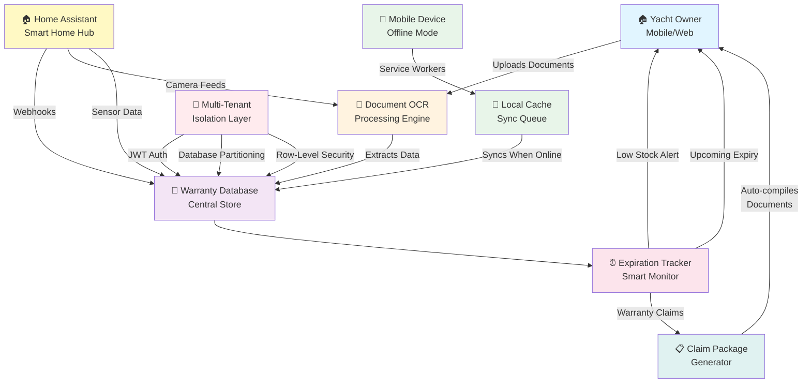

# NaviDocs System Architecture

## Mermaid Architecture Diagram

## Component Explanations

### 1. **Document Upload & OCR Processing**
**What it does:** Yacht owners upload physical warranty documents (photos, PDFs) through the mobile or web app. The OCR (Optical Character Recognition) engine automatically reads the documents and extracts key warranty information like coverage dates, claim numbers, and coverage limits.

**Why it matters:** Eliminates manual data entry. Owners just take a photo of their warranty document, and the system instantly understands what coverage they have.

---

### 2. **Warranty Database (Central Store)**
**What it does:** All extracted warranty data is stored in a secure, centralized database. This is the single source of truth for all warranty information. It's organized by boat, owner, and warranty type.

**Why it matters:** Creates a searchable, organized library of all warranties. Users can instantly find any warranty detail without digging through files.

---

### 3. **Expiration Tracker & Smart Alerts**
**What it does:** The system continuously monitors warranty expiration dates. When a warranty is about to expire (or a maintenance is due), it sends automatic reminders to the yacht owner's phone.

**Why it matters:** No more missed warranty deadlines. Owners stay ahead of expirations and maintenance schedules with zero effort.

---

### 4. **Claim Package Generator**
**What it does:** When a warranty claim is needed, the system automatically compiles all relevant documents—warranty terms, proof of purchase, maintenance records, photos—into a complete claim package ready to submit.

**Why it matters:** Reduces claim submission time from hours to minutes. Everything is pre-organized and ready.

---

### 5. **Home Assistant Integration**
**What it does:** Connects to smart home devices (cameras, door sensors, water monitors) in the boat. These devices send sensor data and camera feeds that can trigger warranty claims automatically (e.g., water damage detected → start claim process).

**Why it matters:** Smart automation—warranty events can be detected automatically and claims initiated without manual intervention.

---

### 6. **Offline Mode (Service Workers & Sync)**
**What it does:** Mobile app works even without internet. Users can upload documents, view warranties, and request alerts while offline. When reconnected, all data automatically syncs to the cloud.

**Why it matters:** Yacht owners are often in remote locations with spotty internet. The app still works seamlessly.

---

### 7. **Multi-Tenant Security Architecture**
**What it does:** Each yacht owner's data is completely isolated. User A cannot see User B's warranties. Security uses JWT tokens (digital ID cards) for login and row-level database security to ensure data privacy.

**Why it matters:** Peace of mind. Sensitive warranty and insurance information is private and protected.

---

## Integration Points

| **Component** | **Connects To** | **Purpose** |
|---|---|---|
| OCR Engine | Warranty Database | Feed extracted data |
| Expiration Tracker | Alert System | Send notifications |
| Claim Generator | Warranty Database | Retrieve documents |
| Home Assistant | Warranty Database | Ingest sensor events |
| Offline Cache | Warranty Database | Sync on reconnect |
| Security Layer | All Components | Encrypt & isolate data |

---

## Data Flow: The Complete Journey

1. **Upload**: Yacht owner takes photo of warranty → uploads to app
2. **Process**: OCR engine reads document → extracts key data
3. **Store**: Warranty info saved to secure database
4. **Alert**: Expiration tracker monitors dates → sends reminder
5. **Generate**: Claim generator auto-compiles documents
6. **Sync**: Offline changes sync when online

---

## Security Features Highlighted

- **JWT Authentication**: Digital verification of user identity on every action
- **Database Isolation**: Each customer's data lives in separate partitions—cannot mix
- **Row-Level Security**: Even within a database, only authorized users can see specific records
- **Encrypted Data**: All sensitive information encrypted at rest and in transit
- **Offline Encryption**: Data cached locally is encrypted until synced
- **Audit Logging**: All access to warranty data is logged for compliance

---

## Non-Technical Summary

NaviDocs is essentially a **smart filing cabinet for yacht warranties**. Owner uploads documents → system reads them → remembers important dates → alerts when action is needed → auto-generates claim packages. It works offline, integrates with smart home devices, and keeps everything private and secure.

**The value:** What used to take hours (finding a warranty, filing a claim) now takes minutes.
