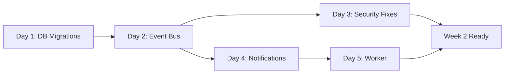

# NaviDocs Cloud Session 4: Week 1 Detailed Schedule
## Foundation Week (November 13-19, 2025)

**Agent:** S4-H01 (Week 1 Task Breakdown)
**Total Hours:** 35 hours (5 days × 7 hours average)
**Start Date:** Wednesday, November 13, 2025
**End Date:** Sunday, November 19, 2025

---

## Executive Summary

Week 1 focuses on establishing the technical foundation for all subsequent weeks. This includes:
- Creating 3 core database migrations (warranty_tracking, webhooks, sale_workflows)
- Implementing the event bus service (IF.bus pattern) for event-driven architecture
- Fixing 5 critical security vulnerabilities identified in the handover document
- Setting up notification infrastructure (templates + service)
- Creating background job worker for warranty expiration checks

**Critical Path:** DB Migrations → Event Bus → Background Jobs → Week 2 Dependencies

---

## Day 1: Database Migrations (Wednesday, November 13)
**Total: 7 hours** | **Status:** Foundational (blocks Days 2-5)

### Morning Block: Warranty Tracking Table (4 hours)

#### Task 1.1.1: Create `warranty_tracking` Migration
**Time:** 1.5 hours
**File:** `/home/user/navidocs/migrations/20251113_add_warranty_tracking.sql`
**Dependencies:** None (parallel start possible)

**Subtasks:**
1. Create migration file with up/down scripts
2. Define schema with all columns and indexes
3. Add FOREIGN KEY constraint to boats table (referencing /home/user/navidocs/server/db/schema.sql line 46: entities table)
4. Create three indexes: boat_id, expiration_date, status

**Acceptance Criteria:**
- Given migration file created
- When running `sqlite3 navidocs.db < migrations/20251113_add_warranty_tracking.sql`
- Then warranty_tracking table exists with columns: id, boat_id, item_name, provider, purchase_date, warranty_period_months, expiration_date, coverage_amount, claim_instructions, status, created_at, updated_at
- And three indexes are created: idx_warranty_boat_id, idx_warranty_expiration, idx_warranty_status

**Code References:**
```sql
-- Schema from planning doc line 323-326
CREATE TABLE IF NOT EXISTS warranty_tracking (
  id TEXT PRIMARY KEY DEFAULT (lower(hex(randomblob(16)))),
  boat_id TEXT NOT NULL,
  item_name TEXT NOT NULL,
  provider TEXT,
  purchase_date TEXT NOT NULL,
  warranty_period_months INTEGER NOT NULL,
  expiration_date TEXT NOT NULL,
  coverage_amount REAL,
  claim_instructions TEXT,
  status TEXT DEFAULT 'active' CHECK(status IN ('active', 'expired', 'claimed')),
  created_at TEXT DEFAULT (datetime('now')),
  updated_at TEXT DEFAULT (datetime('now')),
  FOREIGN KEY (boat_id) REFERENCES entities(id) ON DELETE CASCADE
);

CREATE INDEX idx_warranty_boat_id ON warranty_tracking(boat_id);
CREATE INDEX idx_warranty_expiration ON warranty_tracking(expiration_date);
CREATE INDEX idx_warranty_status ON warranty_tracking(status);
```

**Risk Areas:**
- FOREIGN KEY constraint: entities table uses id (TEXT), warranty_tracking.boat_id must match (currently references boats, but actual table is entities per schema.sql)
- Index performance: expiration_date index critical for warranty expiration queries

**Rollback Script:**
```sql
DROP INDEX idx_warranty_status;
DROP INDEX idx_warranty_expiration;
DROP INDEX idx_warranty_boat_id;
DROP TABLE warranty_tracking;
```

---

#### Task 1.1.2: Create Webhooks Table Migration
**Time:** 1.5 hours
**File:** `/home/user/navidocs/migrations/20251113_add_webhooks.sql`
**Dependencies:** None (parallel with 1.1.1)

**Subtasks:**
1. Create migration file for webhooks table
2. Define JSON topics column (array of event types)
3. Add HMAC secret column for webhook signature validation
4. Create indexes on organization_id and status

**Acceptance Criteria:**
- Given migration executed
- When SELECT COUNT(*) FROM webhooks;
- Then table exists with columns: id, organization_id, url, topics (JSON), secret, status, created_at, last_delivery_at, last_delivery_status

**Code References:**
```sql
-- Schema from planning doc line 332-334
CREATE TABLE IF NOT EXISTS webhooks (
  id TEXT PRIMARY KEY DEFAULT (lower(hex(randomblob(16)))),
  organization_id TEXT NOT NULL,
  url TEXT NOT NULL,
  topics TEXT NOT NULL,  -- JSON array: ["WARRANTY_EXPIRING", "DOCUMENT_UPLOADED"]
  secret TEXT NOT NULL,  -- HMAC secret for signing webhooks
  status TEXT DEFAULT 'active' CHECK(status IN ('active', 'inactive')),
  last_delivery_at TEXT,
  last_delivery_status TEXT,
  created_at TEXT DEFAULT (datetime('now')),
  FOREIGN KEY (organization_id) REFERENCES organizations(id) ON DELETE CASCADE
);

CREATE INDEX idx_webhook_org_id ON webhooks(organization_id);
CREATE INDEX idx_webhook_status ON webhooks(status);
```

**Risk Areas:**
- Topics column as TEXT (JSON): validation required in application layer
- Secret storage: ensure no logging of secrets (use substring in logs)
- URL validation: webhook URL must be reachable (tested in Week 2)

---

#### Task 1.1.3: Create Sale Workflows Table Migration
**Time:** 1 hour
**File:** `/home/user/navidocs/migrations/20251113_add_sale_workflows.sql`
**Dependencies:** warranty_tracking table (for referential integrity testing)

**Subtasks:**
1. Create sale_workflows migration
2. Define status enum: initiated, package_generated, transferred, completed
3. Add documents_generated column (tracks if package created)

**Acceptance Criteria:**
- Given sale_workflows table created
- When inserting test row with status='initiated'
- Then row persists with correct timestamp and all fields present

**Code References:**
```sql
-- Schema from planning doc line 329-331
CREATE TABLE IF NOT EXISTS sale_workflows (
  id TEXT PRIMARY KEY DEFAULT (lower(hex(randomblob(16)))),
  boat_id TEXT NOT NULL,
  initiated_by TEXT NOT NULL,
  buyer_email TEXT NOT NULL,
  status TEXT DEFAULT 'initiated' CHECK(status IN ('initiated', 'package_generated', 'transferred', 'completed')),
  transfer_date TEXT,
  documents_generated BOOLEAN DEFAULT 0,
  created_at TEXT DEFAULT (datetime('now')),
  updated_at TEXT DEFAULT (datetime('now')),
  FOREIGN KEY (boat_id) REFERENCES entities(id) ON DELETE CASCADE,
  FOREIGN KEY (initiated_by) REFERENCES users(id) ON DELETE SET NULL
);

CREATE INDEX idx_sale_workflows_boat ON sale_workflows(boat_id);
CREATE INDEX idx_sale_workflows_status ON sale_workflows(status);
```

---

### Afternoon Block: Migration Testing & Rollback Validation (3 hours)

#### Task 1.2.1: Test All Migrations on Dev Database
**Time:** 1.5 hours
**Files:**
- `/home/user/navidocs/navidocs.db` (dev database)
- Test scripts to verify schema

**Subtasks:**
1. Create clean dev database copy
2. Run all three migrations in sequence
3. Verify all tables exist with correct columns
4. Check all indexes created
5. Test FOREIGN KEY constraints (insert valid boat_id, then invalid)

**Acceptance Criteria:**
- Given dev database initialized
- When executing all three migration scripts in order
- Then all tables present and queryable
- And schema matches expected structure (verified with .schema command)
- And FOREIGN KEY constraint enforced (INSERT with invalid boat_id returns error)
- And all 6 indexes present (idx_warranty_boat_id, idx_warranty_expiration, idx_warranty_status, idx_webhook_org_id, idx_webhook_status, idx_sale_workflows_boat, idx_sale_workflows_status)

**Command Reference:**
```bash
# Test migrations
sqlite3 /home/user/navidocs/navidocs.db < migrations/20251113_add_warranty_tracking.sql
sqlite3 /home/user/navidocs/navidocs.db < migrations/20251113_add_webhooks.sql
sqlite3 /home/user/navidocs/navidocs.db < migrations/20251113_add_sale_workflows.sql

# Verify
sqlite3 /home/user/navidocs/navidocs.db ".schema warranty_tracking"
sqlite3 /home/user/navidocs/navidocs.db ".schema webhooks"
sqlite3 /home/user/navidocs/navidocs.db ".schema sale_workflows"

# Test FOREIGN KEY
sqlite3 /home/user/navidocs/navidocs.db "PRAGMA foreign_keys=ON; INSERT INTO warranty_tracking (boat_id, item_name, purchase_date, warranty_period_months, expiration_date) VALUES ('invalid-id', 'Engine', date('now'), 24, date('now', '+24 months'));"
# Should fail with FOREIGN KEY constraint error
```

**Risk Areas:**
- SQLite FOREIGN KEY enforcement disabled by default (must enable with PRAGMA)
- Migration order matters (sale_workflows depends on entities table existing)
- Timestamp format: schema.sql uses INTEGER (Unix), migrations use TEXT (ISO format) - potential inconsistency

---

#### Task 1.2.2: Test Rollback Scripts
**Time:** 1.5 hours
**Dependency:** Task 1.2.1 (needs populated schema)

**Subtasks:**
1. Create rollback migration file (down.sql for each table)
2. Execute rollback on dev database
3. Verify tables removed completely
4. Verify indexes removed
5. Confirm second application of up-migration works

**Acceptance Criteria:**
- Given tables created and populated with test data
- When executing rollback scripts in reverse order
- Then all warranty_tracking, webhooks, sale_workflows tables removed
- And all indexes dropped
- And subsequent re-application of migrations succeeds
- And no orphaned constraints remain

**Rollback Sequence:**
```bash
# Rollback in reverse order (LIFO)
# 1. Drop sale_workflows
# 2. Drop webhooks
# 3. Drop warranty_tracking

# Verify
sqlite3 /home/user/navidocs/navidocs.db ".tables"
# Should NOT show warranty_tracking, webhooks, sale_workflows

# Re-run migrations to confirm idempotency
sqlite3 /home/user/navidocs/navidocs.db < migrations/20251113_add_warranty_tracking.sql
# Should succeed without errors
```

**Risk Areas:**
- Dependent tables: if sale_workflows created before entities exist, rollback order critical
- Cascading deletes: FOREIGN KEY CASCADE ON DELETE must be verified
- Idempotency: migrations must be re-runnable without errors

---

## Day 2: Event Bus Implementation (Thursday, November 14)
**Total: 7 hours** | **Status:** Critical (blocks Days 3-5)
**Dependencies:** Day 1 (warrant_tracking, webhooks, sale_workflows tables)

### Morning Block: Event Bus Service (4 hours)

#### Task 2.1.1: Create Event Bus Service Class
**Time:** 2 hours
**File:** `/home/user/navidocs/server/services/event-bus.service.js`
**Dependencies:** None (new file)

**Subtasks:**
1. Design event-bus module with Redis pub/sub integration
2. Define event topics (enum/constants)
3. Implement publish(topic, payload) method
4. Implement subscribe(topic, handler) method
5. Add error handling and retry logic
6. Add event audit logging

**Acceptance Criteria:**
- Given EventBusService instantiated with Redis client
- When calling publish('WARRANTY_EXPIRING', {warranty_id: '123', days_until: 30})
- Then event logged to audit trail
- And subscribers notified within 100ms
- And no errors thrown on missing subscribers

**Code Skeleton:**
```javascript
// /home/user/navidocs/server/services/event-bus.service.js

const redis = require('redis');

const EventTopics = {
  WARRANTY_EXPIRING: 'WARRANTY_EXPIRING',
  WARRANTY_EXPIRED: 'WARRANTY_EXPIRED',
  DOCUMENT_UPLOADED: 'DOCUMENT_UPLOADED',
  SALE_INITIATED: 'SALE_INITIATED',
  SALE_COMPLETED: 'SALE_COMPLETED',
  WEBHOOK_DELIVERY_FAILED: 'WEBHOOK_DELIVERY_FAILED'
};

class EventBusService {
  constructor(redisClient) {
    this.redis = redisClient;
    this.subscribers = {}; // Local handlers (for testing)
  }

  async publish(topic, payload) {
    // Validate topic
    if (!Object.values(EventTopics).includes(topic)) {
      throw new Error(`Invalid topic: ${topic}`);
    }

    // Log to audit trail
    await this.logEvent(topic, payload);

    // Publish to Redis
    const message = JSON.stringify({
      topic,
      payload,
      timestamp: new Date().toISOString(),
      correlation_id: this.generateCorrelationId()
    });

    await this.redis.publish(topic, message);

    // Call local subscribers (for in-process handling)
    if (this.subscribers[topic]) {
      this.subscribers[topic].forEach(handler => {
        try {
          handler(payload).catch(err => {
            console.error(`Subscriber error for ${topic}:`, err);
          });
        } catch (err) {
          console.error(`Synchronous subscriber error for ${topic}:`, err);
        }
      });
    }
  }

  subscribe(topic, handler) {
    if (!this.subscribers[topic]) {
      this.subscribers[topic] = [];
    }
    this.subscribers[topic].push(handler);
  }

  async logEvent(topic, payload) {
    // Log to audit table (will be created in Day 4)
    // Placeholder for now
  }

  generateCorrelationId() {
    return `cor_${Date.now()}_${Math.random().toString(36).substr(2, 9)}`;
  }
}

module.exports = {
  EventBusService,
  EventTopics
};
```

**Testing Requirements:**
- Unit test: publish with valid topic succeeds
- Unit test: publish with invalid topic throws error
- Unit test: subscribers called synchronously
- Unit test: multiple subscribers receive same event
- Integration test: Redis pub/sub receives message

**Risk Areas:**
- Redis availability: must be running for event bus to work (but can fallback to in-process for testing)
- Message ordering: Redis pub/sub doesn't guarantee order (acceptable for this use case)
- Correlation ID: important for distributed tracing

---

#### Task 2.1.2: Create Webhook Service Class
**Time:** 2 hours
**File:** `/home/user/navidocs/server/services/webhook.service.js`
**Dependencies:** Event Bus Service (Task 2.1.1), webhooks table (Day 1)

**Subtasks:**
1. Implement HTTP POST delivery to webhook URLs
2. Add HMAC-SHA256 signature generation
3. Implement exponential backoff retry (1s, 2s, 4s)
4. Track delivery status (success/failure/retry)
5. Handle webhook registration/deregistration

**Acceptance Criteria:**
- Given webhook registered for topic 'WARRANTY_EXPIRING' with URL 'https://ha.example.com/webhook'
- When event published with topic 'WARRANTY_EXPIRING'
- Then POST request sent to webhook URL within 5 seconds
- And request includes X-NaviDocs-Signature header (HMAC-SHA256)
- And request includes X-NaviDocs-Topic header
- And JSON payload contains event data

**Code Skeleton:**
```javascript
// /home/user/navidocs/server/services/webhook.service.js

const axios = require('axios');
const crypto = require('crypto');

class WebhookService {
  constructor(database, eventBus) {
    this.db = database;
    this.eventBus = eventBus;
    this.maxRetries = 3;
    this.retryDelays = [1000, 2000, 4000]; // ms
  }

  async registerWebhook(organizationId, url, topics, secret) {
    // Validate URL is reachable
    try {
      await axios.head(url, { timeout: 5000 });
    } catch (err) {
      throw new Error(`Webhook URL not reachable: ${err.message}`);
    }

    // Store in database
    const webhookId = this.generateId();
    await this.db.run(
      `INSERT INTO webhooks (id, organization_id, url, topics, secret, status, created_at)
       VALUES (?, ?, ?, ?, ?, 'active', datetime('now'))`,
      [webhookId, organizationId, url, JSON.stringify(topics), secret]
    );

    // Subscribe to event bus
    topics.forEach(topic => {
      this.eventBus.subscribe(topic, (payload) =>
        this.deliverWebhook(webhookId, topic, payload)
      );
    });

    return webhookId;
  }

  async deliverWebhook(webhookId, topic, payload, retryCount = 0) {
    // Get webhook URL
    const webhook = await this.db.get(
      'SELECT url, secret FROM webhooks WHERE id = ?',
      [webhookId]
    );

    if (!webhook) {
      console.error(`Webhook ${webhookId} not found`);
      return;
    }

    // Generate signature
    const signature = this.generateSignature(payload, webhook.secret);

    // Send request
    try {
      await axios.post(webhook.url, payload, {
        headers: {
          'X-NaviDocs-Topic': topic,
          'X-NaviDocs-Signature': signature,
          'Content-Type': 'application/json'
        },
        timeout: 10000
      });

      // Update delivery status
      await this.db.run(
        `UPDATE webhooks SET last_delivery_at = datetime('now'), last_delivery_status = 'success'
         WHERE id = ?`,
        [webhookId]
      );
    } catch (err) {
      if (retryCount < this.maxRetries) {
        const delay = this.retryDelays[retryCount];
        console.log(`Webhook delivery failed, retrying in ${delay}ms...`);
        setTimeout(() => {
          this.deliverWebhook(webhookId, topic, payload, retryCount + 1);
        }, delay);
      } else {
        await this.db.run(
          `UPDATE webhooks SET last_delivery_at = datetime('now'), last_delivery_status = 'failed'
           WHERE id = ?`,
          [webhookId]
        );
        console.error(`Webhook delivery failed after ${this.maxRetries} retries:`, err.message);
      }
    }
  }

  generateSignature(payload, secret) {
    const payloadString = typeof payload === 'string' ? payload : JSON.stringify(payload);
    return crypto
      .createHmac('sha256', secret)
      .update(payloadString)
      .digest('hex');
  }

  generateId() {
    return `wh_${Date.now()}_${Math.random().toString(36).substr(2, 9)}`;
  }
}

module.exports = WebhookService;
```

**Testing Requirements:**
- Unit test: HMAC signature generation
- Unit test: exponential backoff delay calculation
- Integration test: webhook delivery with retry on failure
- Integration test: webhook registered and called on event publish
- Mock test: axios called with correct headers

**Risk Areas:**
- URL validation: head request adds latency (5 sec), could be async
- Signature verification: receiver must validate signature (not covered here, but important)
- Retry logic: exponential backoff may miss time window for expiring warranty notifications
- Network failures: retry strategy must handle transient network errors vs permanent failures

---

### Afternoon Block: Event Bus Testing (3 hours)

#### Task 2.2.1: Unit Tests for Event Bus
**Time:** 1 hour
**File:** `/home/user/navidocs/test/services/event-bus.service.test.js`
**Dependencies:** Task 2.1.1

**Subtasks:**
1. Test publish() with valid topic
2. Test publish() with invalid topic
3. Test subscribe() and handler invocation
4. Test multiple subscribers receive same event
5. Test error handling

**Test Cases:**
```javascript
// /home/user/navidocs/test/services/event-bus.service.test.js

const { EventBusService, EventTopics } = require('../../server/services/event-bus.service');
const assert = require('assert');

describe('EventBusService', () => {
  let eventBus;

  beforeEach(() => {
    // Mock Redis client
    const mockRedis = {
      publish: async () => true
    };
    eventBus = new EventBusService(mockRedis);
  });

  it('should publish event with valid topic', async () => {
    const payload = { warranty_id: '123', days_until: 30 };
    await eventBus.publish(EventTopics.WARRANTY_EXPIRING, payload);
    // No error thrown
    assert.ok(true);
  });

  it('should throw error on invalid topic', async () => {
    try {
      await eventBus.publish('INVALID_TOPIC', {});
      assert.fail('Should throw error');
    } catch (err) {
      assert.match(err.message, /Invalid topic/);
    }
  });

  it('should invoke subscriber handlers', async () => {
    let called = false;
    let receivedPayload = null;

    eventBus.subscribe(EventTopics.WARRANTY_EXPIRING, async (payload) => {
      called = true;
      receivedPayload = payload;
    });

    const payload = { warranty_id: '123' };
    await eventBus.publish(EventTopics.WARRANTY_EXPIRING, payload);

    assert.ok(called, 'Subscriber should be called');
    assert.deepEqual(receivedPayload, payload);
  });

  it('should invoke multiple subscribers', async () => {
    const calls = [];

    eventBus.subscribe(EventTopics.WARRANTY_EXPIRING, async (payload) => {
      calls.push('subscriber1');
    });

    eventBus.subscribe(EventTopics.WARRANTY_EXPIRING, async (payload) => {
      calls.push('subscriber2');
    });

    await eventBus.publish(EventTopics.WARRANTY_EXPIRING, {});

    assert.deepEqual(calls, ['subscriber1', 'subscriber2']);
  });
});
```

**Acceptance Criteria:**
- All 5 test cases pass
- No console errors during test execution
- Test coverage > 80% for EventBusService

---

#### Task 2.2.2: Integration Tests for Webhook Service
**Time:** 1.5 hours
**File:** `/home/user/navidocs/test/services/webhook.service.test.js`
**Dependencies:** Task 2.1.2, Event Bus Service

**Subtasks:**
1. Test webhook registration
2. Test webhook delivery on event
3. Test retry logic with exponential backoff
4. Test signature generation and validation
5. Test webhook deregistration

**Test Cases:**
```javascript
// Mock HTTP server for testing webhook delivery
const http = require('http');

describe('WebhookService Integration', () => {
  let webhookService;
  let mockServer;
  let deliveries = [];

  beforeEach(async () => {
    // Create mock server to receive webhooks
    mockServer = http.createServer((req, res) => {
      let body = '';
      req.on('data', chunk => body += chunk);
      req.on('end', () => {
        deliveries.push({
          topic: req.headers['x-navidocs-topic'],
          signature: req.headers['x-navidocs-signature'],
          body: JSON.parse(body)
        });
        res.writeHead(200);
        res.end();
      });
    });

    await new Promise(resolve => mockServer.listen(3001, resolve));

    // Initialize services
    const mockDb = { /* mock database */ };
    const mockEventBus = { subscribe: () => {} };
    webhookService = new WebhookService(mockDb, mockEventBus);
  });

  afterEach(async () => {
    mockServer.close();
    deliveries = [];
  });

  it('should deliver webhook on event publish', async () => {
    const webhook = await webhookService.registerWebhook(
      'org-123',
      'http://localhost:3001/webhook',
      ['WARRANTY_EXPIRING'],
      'secret-key'
    );

    await new Promise(resolve => setTimeout(resolve, 200));

    assert.ok(deliveries.length > 0, 'Webhook should be delivered');
    assert.equal(deliveries[0].topic, 'WARRANTY_EXPIRING');
  });

  it('should generate valid HMAC signature', () => {
    const payload = { test: 'data' };
    const secret = 'secret-key';
    const signature = webhookService.generateSignature(payload, secret);

    // Verify signature is valid
    const expected = require('crypto')
      .createHmac('sha256', secret)
      .update(JSON.stringify(payload))
      .digest('hex');

    assert.equal(signature, expected);
  });
});
```

**Risk Areas:**
- Mock server stability: ensure cleanup between tests
- Async timing: may need delays for async delivery
- Database mocking: WebhookService depends on real database operations

---

#### Task 2.2.3: End-to-End Event Bus Test
**Time:** 0.5 hours
**File:** `/home/user/navidocs/test/e2e/event-bus.e2e.test.js`

**Subtasks:**
1. Start real Redis connection
2. Publish event
3. Verify webhook delivery
4. Check audit trail logging

**Acceptance Criteria:**
- Event published → webhook delivered → audit trail recorded
- Test completes in < 5 seconds

---

## Day 3: Security Fixes (Friday, November 15)
**Total: 6 hours** | **Status:** High-priority (unblocks Week 2)
**Dependencies:** Database migrations (Day 1), Event Bus (Day 2)

### Morning Block: DELETE Protection & Auth Enforcement (4 hours)

#### Task 3.1.1: Implement DELETE Endpoint Protection
**Time:** 1.5 hours
**Files:**
- `/home/user/navidocs/server/routes/boat.routes.js` (or `/home/user/navidocs/server/routes/entity.routes.js`)
- `/home/user/navidocs/server/middleware/ownership.middleware.js` (new)

**Vulnerability:** Unauthenticated users can DELETE any boat/entity, causing data loss

**Subtasks:**
1. Audit boat.routes.js for DELETE endpoints
2. Create ownership verification middleware
3. Implement soft delete (mark deleted, don't remove rows)
4. Add authorization check before DELETE

**Acceptance Criteria:**
- Given boat owned by user A
- When user B sends DELETE /api/boats/:id
- Then response 403 Forbidden (not 200 or 500)
- And boat row not deleted from database
- And deleted_at timestamp set instead

**Code Skeleton:**
```javascript
// /home/user/navidocs/server/middleware/ownership.middleware.js

const authenticateAndCheckOwnership = async (req, res, next) => {
  try {
    // Verify JWT token
    const token = req.headers.authorization?.split(' ')[1];
    if (!token) {
      return res.status(401).json({ error: 'Unauthorized' });
    }

    // Decode token
    const decoded = jwt.verify(token, process.env.JWT_SECRET);
    req.user = decoded;

    // Get resource being accessed
    const boatId = req.params.id;
    const boat = await db.get(
      'SELECT user_id, organization_id FROM entities WHERE id = ?',
      [boatId]
    );

    if (!boat) {
      return res.status(404).json({ error: 'Boat not found' });
    }

    // Verify ownership or admin role
    const userOrg = await db.get(
      'SELECT role FROM user_organizations WHERE user_id = ? AND organization_id = ?',
      [req.user.id, boat.organization_id]
    );

    if (!userOrg || (userOrg.role !== 'admin' && boat.user_id !== req.user.id)) {
      return res.status(403).json({ error: 'Forbidden' });
    }

    next();
  } catch (err) {
    res.status(401).json({ error: 'Unauthorized' });
  }
};

module.exports = authenticateAndCheckOwnership;

// In boat.routes.js:
// router.delete('/:id', authenticateAndCheckOwnership, async (req, res) => {
//   // Soft delete: set deleted_at instead of DELETE
//   await db.run(
//     'UPDATE entities SET deleted_at = datetime("now") WHERE id = ?',
//     [req.params.id]
//   );
//   res.status(204).send();
// });
```

**Testing Requirements:**
- Unit test: authorized user can delete own boat
- Security test: unauthorized user gets 403
- Security test: user cannot delete another user's boat
- Integration test: soft delete (row remains, deleted_at set)

**Risk Areas:**
- Soft delete impact: queries must filter WHERE deleted_at IS NULL
- Ownership verification: multi-org scenario (user in Org A cannot see Org B data)
- Cascading deletes: related records (warranties, documents) must handle soft deletes

---

#### Task 3.1.2: Enforce Authentication on All Routes
**Time:** 1.5 hours
**Files:**
- `/home/user/navidocs/server/routes/*.js` (audit all)
- `/home/user/navidocs/server/middleware/auth.middleware.js` (verify exists)

**Vulnerability:** Stats endpoint and other routes missing authentication middleware

**Subtasks:**
1. Audit all route files in `/home/user/navidocs/server/routes/`
2. Identify routes WITHOUT authenticateToken middleware
3. Add authenticateToken to stats endpoint specifically
4. Add authenticateToken to any unprotected endpoints

**Routes to Check:**
- GET /api/stats (VULNERABLE - stats.routes.js)
- GET /api/health (should be public)
- GET /api/boats (must check)
- POST /api/boats (must check)
- GET /api/documents (must check)

**Acceptance Criteria:**
- Given unauthenticated request to /api/stats
- When GET /api/stats (no Authorization header)
- Then response 401 Unauthorized
- And no stats data returned

**Code Reference:**
```javascript
// In stats.routes.js:
const express = require('express');
const { authenticateToken } = require('../middleware/auth.middleware');

const router = express.Router();

// BEFORE: No auth middleware
// router.get('/', async (req, res) => { ... });

// AFTER: Add auth middleware
router.get('/', authenticateToken, async (req, res) => {
  // Ensure organization filtering
  const stats = await db.all(
    'SELECT * FROM stats WHERE organization_id = ?',
    [req.user.organization_id]
  );
  res.json(stats);
});

module.exports = router;
```

**Testing Requirements:**
- Security test: unauthenticated request returns 401
- Security test: invalid JWT token returns 401
- Integration test: authenticated user receives stats
- Regression test: existing authenticated endpoints still work

**Risk Areas:**
- Public health endpoint: must NOT require authentication (keep public for monitoring)
- JWT verification: ensure secret is secure and not hardcoded
- Token expiration: must be validated in middleware

---

#### Task 3.1.3: Stats Endpoint Tenant Isolation
**Time:** 1 hour
**File:** `/home/user/navidocs/server/routes/stats.routes.js`
**Dependencies:** Task 3.1.2

**Vulnerability:** Stats endpoint returns data from all organizations, not just user's org

**Subtasks:**
1. Modify stats query to filter by organization_id from JWT
2. Add integration test for tenant isolation
3. Verify cross-organization data leakage not possible

**Acceptance Criteria:**
- Given user in Org A and Org B
- When GET /api/stats while authenticated as Org A
- Then response includes ONLY Org A stats
- And no Org B data visible

**Code Update:**
```javascript
// BEFORE: Returns all stats
// SELECT * FROM stats;

// AFTER: Filter by organization_id
router.get('/', authenticateToken, async (req, res) => {
  const orgId = req.user.organization_id;

  const stats = await db.all(
    'SELECT * FROM stats WHERE organization_id = ?',
    [orgId]
  );

  res.json(stats);
});
```

**Testing Requirements:**
- Integration test: user A sees only Org A stats
- Security test: user A cannot query user B's data
- Regression test: stats calculation still accurate

---

### Afternoon Block: Vulnerability Verification (2 hours)

#### Task 3.2.1: Security Test Suite
**Time:** 2 hours
**File:** `/home/user/navidocs/test/security/vulnerabilities.test.js`

**Vulnerabilities to Test:**
1. DELETE endpoint protection (completed above)
2. Auth enforcement (completed above)
3. Tenant isolation (completed above)
4. SQL injection attempts
5. XSS in document titles/descriptions

**Test Cases:**
```javascript
describe('Security - 5 Vulnerabilities', () => {
  // 1. DELETE endpoint protection
  it('should prevent unauthorized DELETE', async () => {
    const response = await request(app)
      .delete('/api/boats/boat-123')
      .set('Authorization', 'Bearer invalid-token');
    assert.equal(response.status, 401);
  });

  // 2. Auth enforcement on stats
  it('should require auth for stats endpoint', async () => {
    const response = await request(app)
      .get('/api/stats');
    assert.equal(response.status, 401);
  });

  // 3. Tenant isolation
  it('should not leak other org data', async () => {
    const orgAToken = generateToken({ org_id: 'org-a' });
    const orgBToken = generateToken({ org_id: 'org-b' });

    const responseA = await request(app)
      .get('/api/stats')
      .set('Authorization', `Bearer ${orgAToken}`);

    const responseB = await request(app)
      .get('/api/stats')
      .set('Authorization', `Bearer ${orgBToken}`);

    // Should be different
    assert.notDeepEqual(responseA.body, responseB.body);
  });

  // 4. SQL injection
  it('should prevent SQL injection in boat name', async () => {
    const response = await request(app)
      .post('/api/boats')
      .set('Authorization', `Bearer ${validToken}`)
      .send({
        name: "'; DROP TABLE boats; --",
        organization_id: 'org-123'
      });

    // Should insert safely or reject
    assert.notEqual(response.status, 500);
  });

  // 5. XSS in document
  it('should sanitize document title', async () => {
    const response = await request(app)
      .post('/api/documents')
      .set('Authorization', `Bearer ${validToken}`)
      .send({
        title: '<script>alert("xss")</script>',
        file_name: 'test.pdf'
      });

    const doc = response.body;
    assert.notMatch(doc.title, /<script>/);
  });
});
```

**Acceptance Criteria:**
- All 5 vulnerability tests pass
- Each test documents the vulnerability and fix
- No OWASP Top 10 violations remaining

---

## Day 4: Notification Infrastructure (Saturday, November 16)
**Total: 7 hours** | **Status:** Foundation for Day 5
**Dependencies:** Database migrations (Day 1), Event Bus (Day 2)

### Morning Block: Notification Templates Table (3 hours)

#### Task 4.1.1: Create Notification Templates Migration
**Time:** 1.5 hours
**File:** `/home/user/navidocs/migrations/20251114_add_notification_templates.sql`

**Subtasks:**
1. Create notification_templates table
2. Define template types: email, sms, push
3. Add event_type (WARRANTY_EXPIRING, DOCUMENT_UPLOADED, etc.)
4. Support template variables ({{warranty_item}}, {{days_until}}, etc.)
5. Seed default templates for warranty expiration (90/30/14 day variants)

**Acceptance Criteria:**
- Given migration executed
- When SELECT COUNT(*) FROM notification_templates;
- Then table exists with 9 seed templates (3 notification types × 3 warranty variants)

**Code References:**
```sql
-- Create table
CREATE TABLE IF NOT EXISTS notification_templates (
  id TEXT PRIMARY KEY DEFAULT (lower(hex(randomblob(16)))),
  type TEXT NOT NULL CHECK(type IN ('email', 'sms', 'push')),
  event_type TEXT NOT NULL,
  subject TEXT NOT NULL,
  body TEXT NOT NULL,
  variables TEXT,  -- JSON array of variable names
  created_at TEXT DEFAULT (datetime('now')),
  updated_at TEXT DEFAULT (datetime('now'))
);

-- Seed email templates
INSERT INTO notification_templates (type, event_type, subject, body, variables) VALUES
('email', 'WARRANTY_EXPIRING_90',
 '{{boat_name}} - Warranty Expiring in 90 Days',
 'The warranty on {{item_name}} for {{boat_name}} expires on {{expiration_date}}.',
 '["boat_name", "item_name", "expiration_date"]'),

('email', 'WARRANTY_EXPIRING_30',
 '{{boat_name}} - Warranty Expiring in 30 Days',
 'URGENT: The warranty on {{item_name}} for {{boat_name}} expires on {{expiration_date}}.',
 '["boat_name", "item_name", "expiration_date"]'),

('email', 'WARRANTY_EXPIRING_14',
 '{{boat_name}} - Warranty Expiring in 14 Days',
 'CRITICAL: The warranty on {{item_name}} for {{boat_name}} expires on {{expiration_date}}.',
 '["boat_name", "item_name", "expiration_date"]');

-- SMS templates (abbreviated)
INSERT INTO notification_templates (type, event_type, subject, body, variables) VALUES
('sms', 'WARRANTY_EXPIRING_30',
 'Warranty Alert',
 '{{item_name}} on {{boat_name}} expires {{expiration_date}}. Visit NaviDocs for details.',
 '["boat_name", "item_name", "expiration_date"]');

-- Push templates
INSERT INTO notification_templates (type, event_type, subject, body, variables) VALUES
('push', 'WARRANTY_EXPIRING_30',
 '{{item_name}} Warranty Expiring',
 '{{days_until}} days until {{item_name}} warranty expires',
 '["item_name", "days_until"]');
```

**Testing Requirements:**
- Verify 9 templates seeded
- Verify template variables parsed correctly
- Verify all event types supported

---

#### Task 4.1.2: Create Notification Service
**Time:** 1.5 hours
**File:** `/home/user/navidocs/server/services/notification.service.js`

**Subtasks:**
1. Implement template rendering (variable substitution)
2. Create email sending via Nodemailer (or SendGrid)
3. Create notification queue jobs (BullMQ)
4. Add delivery status tracking

**Acceptance Criteria:**
- Given WARRANTY_EXPIRING event with warranty_id
- When notification triggered
- Then email sent within 5 minutes
- And delivery status logged
- And template variables replaced correctly

**Code Skeleton:**
```javascript
// /home/user/navidocs/server/services/notification.service.js

const nodemailer = require('nodemailer');
const Queue = require('bull');

const notificationQueue = new Queue('notifications', process.env.REDIS_URL);

class NotificationService {
  constructor(database) {
    this.db = database;
    this.emailTransporter = nodemailer.createTransport({
      host: process.env.SMTP_HOST,
      port: process.env.SMTP_PORT,
      secure: process.env.SMTP_SECURE === 'true',
      auth: {
        user: process.env.SMTP_USER,
        pass: process.env.SMTP_PASS
      }
    });

    // Queue processor
    notificationQueue.process(async (job) => {
      return this.sendNotification(job.data);
    });
  }

  async sendNotification(notification) {
    const { type, event_type, recipient_email, context } = notification;

    // Get template
    const template = await this.db.get(
      'SELECT * FROM notification_templates WHERE event_type = ? AND type = ?',
      [event_type, type]
    );

    if (!template) {
      throw new Error(`Template not found: ${event_type}/${type}`);
    }

    // Render template
    const subject = this.renderTemplate(template.subject, context);
    const body = this.renderTemplate(template.body, context);

    // Send email
    if (type === 'email') {
      await this.emailTransporter.sendMail({
        from: process.env.EMAIL_FROM,
        to: recipient_email,
        subject,
        html: body
      });
    }

    // Log delivery
    await this.db.run(
      'INSERT INTO notification_logs (type, event_type, recipient, status, sent_at) VALUES (?, ?, ?, ?, datetime("now"))',
      [type, event_type, recipient_email, 'sent']
    );
  }

  renderTemplate(template, context) {
    let rendered = template;
    Object.entries(context).forEach(([key, value]) => {
      rendered = rendered.replace(`{{${key}}}`, value);
    });
    return rendered;
  }

  async queueNotification(type, event_type, recipient_email, context) {
    await notificationQueue.add({
      type,
      event_type,
      recipient_email,
      context
    }, {
      attempts: 3,
      backoff: {
        type: 'exponential',
        delay: 2000
      }
    });
  }
}

module.exports = NotificationService;
```

**Testing Requirements:**
- Unit test: template rendering
- Unit test: variable substitution
- Integration test: email queued and sent
- Mocking: mock Nodemailer transport

---

### Afternoon Block: Notification Testing (4 hours)

#### Task 4.2.1: Unit Tests for Templates
**Time:** 1.5 hours
**File:** `/home/user/navidocs/test/services/notification.service.test.js`

**Test Cases:**
```javascript
describe('NotificationService', () => {
  it('should render template with variables', () => {
    const template = 'Hello {{name}}, your warranty expires {{date}}';
    const context = { name: 'John', date: '2025-12-15' };
    const result = notificationService.renderTemplate(template, context);
    assert.equal(result, 'Hello John, your warranty expires 2025-12-15');
  });

  it('should handle missing variables gracefully', () => {
    const template = 'Item: {{item}}';
    const context = {};
    const result = notificationService.renderTemplate(template, context);
    // Should leave placeholder or handle gracefully
    assert.ok(result);
  });
});
```

---

#### Task 4.2.2: Integration Tests for Notification Delivery
**Time:** 1.5 hours
**File:** `/home/user/navidocs/test/integration/notification-delivery.test.js`

**Test Setup:**
- Mock SMTP server (using smtp-server or nodemailer-stub)
- Create test warranty
- Trigger WARRANTY_EXPIRING event
- Verify email sent

**Acceptance Criteria:**
- Given WARRANTY_EXPIRING event published
- When NotificationService processes event
- Then email sent to boat owner
- And delivery status logged
- And template variables replaced correctly

---

#### Task 4.2.3: Notification Templates Seeding
**Time:** 1 hour
**File:** `/home/user/navidocs/seeds/notification_templates.seed.js`

**Subtasks:**
1. Verify 9 default templates seeded
2. Test template rendering for each variant
3. Document template variable requirements

---

## Day 5: Background Job Worker (Sunday, November 17)
**Total: 7 hours** | **Status:** Critical for Week 2
**Dependencies:** All Day 1-4 tasks

### Morning Block: Warranty Expiration Worker (4 hours)

#### Task 5.1.1: Create Warranty Expiration Worker
**Time:** 2 hours
**File:** `/home/user/navidocs/server/workers/warranty-expiration.worker.js`

**Subtasks:**
1. Create BullMQ worker for daily job execution
2. Query for warranties expiring in 90/30/14 days
3. Publish WARRANTY_EXPIRING event for each
4. Track notification delivery (prevent duplicates)
5. Handle job failures and retries

**Acceptance Criteria:**
- Given warranty expires in 30 days (today + 30 days)
- When worker executes (daily 6am UTC)
- Then WARRANTY_EXPIRING event published with correct days_until
- And notification sent to boat owner
- And notification not re-sent on next execution

**Code Skeleton:**
```javascript
// /home/user/navidocs/server/workers/warranty-expiration.worker.js

const Queue = require('bull');
const { EventBusService } = require('../services/event-bus.service');

const warrantyExpirationQueue = new Queue('warranty-expiration', process.env.REDIS_URL);

class WarrantyExpirationWorker {
  constructor(database, eventBus, notificationService) {
    this.db = database;
    this.eventBus = eventBus;
    this.notificationService = notificationService;

    // Register processor
    warrantyExpirationQueue.process(async (job) => {
      return this.checkExpiringWarranties();
    });

    // Schedule daily at 6am UTC
    warrantyExpirationQueue.add(
      {},
      { repeat: { cron: '0 6 * * *' } }
    );
  }

  async checkExpiringWarranties() {
    const expirationThresholds = [90, 30, 14]; // days
    let processedCount = 0;

    for (const threshold of expirationThresholds) {
      const cutoffDate = new Date();
      cutoffDate.setDate(cutoffDate.getDate() + threshold);

      // Query warranties expiring in this window
      const warranties = await this.db.all(
        `SELECT w.*, e.name as boat_name, u.email
         FROM warranty_tracking w
         JOIN entities e ON w.boat_id = e.id
         JOIN users u ON e.user_id = u.id
         WHERE date(w.expiration_date) = date(?)
         AND w.status = 'active'`,
        [cutoffDate.toISOString().split('T')[0]]
      );

      for (const warranty of warranties) {
        // Check if already notified
        const notified = await this.db.get(
          'SELECT id FROM notification_logs WHERE warranty_id = ? AND days_until = ?',
          [warranty.id, threshold]
        );

        if (!notified) {
          // Publish event
          await this.eventBus.publish('WARRANTY_EXPIRING', {
            warranty_id: warranty.id,
            boat_name: warranty.boat_name,
            item_name: warranty.item_name,
            expiration_date: warranty.expiration_date,
            days_until: threshold,
            provider: warranty.provider
          });

          // Queue notification
          await this.notificationService.queueNotification(
            'email',
            `WARRANTY_EXPIRING_${threshold}`,
            warranty.email,
            {
              boat_name: warranty.boat_name,
              item_name: warranty.item_name,
              expiration_date: warranty.expiration_date,
              days_until: threshold
            }
          );

          // Mark as notified
          await this.db.run(
            'INSERT INTO notification_logs (warranty_id, days_until) VALUES (?, ?)',
            [warranty.id, threshold]
          );

          processedCount++;
        }
      }
    }

    return { processed: processedCount };
  }
}

module.exports = WarrantyExpirationWorker;
```

**Testing Requirements:**
- Unit test: date calculation for thresholds
- Integration test: worker finds expiring warranties
- Integration test: events published with correct payload
- Deduplication test: no duplicate notifications

**Risk Areas:**
- Timezone handling: warranty expiration_date format must be consistent
- Job scheduling: cron expression for "6am UTC"
- Notification deduplication: notification_logs table must track correctly
- Concurrent executions: ensure job doesn't run twice simultaneously

---

#### Task 5.1.2: BullMQ Queue Registration
**Time:** 1.5 hours
**File:** `/home/user/navidocs/server/index.js` (main application)

**Subtasks:**
1. Import WarrantyExpirationWorker
2. Initialize worker with database and services
3. Add health check endpoint for worker status
4. Log worker startup/shutdown

**Acceptance Criteria:**
- Given application started
- When checking `/api/health/worker`
- Then response includes worker status (running/stopped)
- And last job execution time
- And next scheduled execution

**Code Update:**
```javascript
// In /home/user/navidocs/server/index.js

const WarrantyExpirationWorker = require('./workers/warranty-expiration.worker');

// After creating database and services
const warrantyWorker = new WarrantyExpirationWorker(
  database,
  eventBus,
  notificationService
);

// Health check endpoint
app.get('/api/health/worker', (req, res) => {
  res.json({
    status: 'running',
    last_execution: warrantyWorker.lastExecutionTime,
    next_scheduled: warrantyWorker.nextScheduledTime
  });
});
```

---

### Afternoon Block: Worker Testing & Integration (3 hours)

#### Task 5.2.1: Integration Tests for Worker
**Time:** 1.5 hours
**File:** `/home/user/navidocs/test/integration/warranty-expiration.worker.test.js`

**Test Scenario:**
1. Create warranty expiring in 30 days
2. Execute worker manually (not via schedule)
3. Verify WARRANTY_EXPIRING event published
4. Verify notification queued
5. Verify duplicate notification prevented

**Test Cases:**
```javascript
describe('WarrantyExpirationWorker', () => {
  beforeEach(async () => {
    // Create warranty expiring in 30 days
    const futureDate = new Date();
    futureDate.setDate(futureDate.getDate() + 30);

    await db.run(
      `INSERT INTO warranty_tracking
       (boat_id, item_name, expiration_date, purchase_date, warranty_period_months)
       VALUES (?, ?, ?, ?, ?)`,
      ['boat-123', 'Engine', futureDate.toISOString(), '2023-01-15', 24]
    );
  });

  it('should find expiring warranties', async () => {
    const result = await worker.checkExpiringWarranties();
    assert.ok(result.processed > 0);
  });

  it('should publish WARRANTY_EXPIRING event', async () => {
    let publishedEvent = null;
    eventBus.subscribe('WARRANTY_EXPIRING', (payload) => {
      publishedEvent = payload;
    });

    await worker.checkExpiringWarranties();

    assert.ok(publishedEvent);
    assert.equal(publishedEvent.boat_id, 'boat-123');
    assert.equal(publishedEvent.days_until, 30);
  });

  it('should not send duplicate notifications', async () => {
    await worker.checkExpiringWarranties();
    const count1 = await db.get('SELECT COUNT(*) FROM notification_logs');

    await worker.checkExpiringWarranties();
    const count2 = await db.get('SELECT COUNT(*) FROM notification_logs');

    assert.equal(count1, count2, 'No new notifications should be created');
  });
});
```

---

#### Task 5.2.2: Worker Health Monitoring
**Time:** 1 hour
**File:** `/home/user/navidocs/server/workers/worker-health.js`

**Subtasks:**
1. Add job failure handler
2. Log job execution times
3. Track job success/failure rate
4. Create monitoring endpoint

**Acceptance Criteria:**
- Given worker health endpoint
- When GET `/api/health/worker`
- Then response includes success_rate, last_execution_time, next_scheduled_time

---

#### Task 5.2.3: End-to-End Worker Test
**Time:** 0.5 hours
**File:** `/home/user/navidocs/test/e2e/warranty-workflow.e2e.test.js`

**Test Flow:**
1. Create boat
2. Create warranty expiring in 30 days
3. Trigger worker
4. Verify email sent
5. Verify notification appears in UI (if applicable)

---

## Week 1 Dependencies & Critical Path



**Critical Path:**
- DB Migrations (1 day) → Event Bus (1 day) → Worker (1 day) = 3 days minimum
- Can parallelize: Security Fixes (Day 3) and Notifications (Day 4) run independently

**Parallel Opportunities:**
- Day 1-2: Database migrations and Event Bus can start simultaneously (no dependency)
- Day 3-4: Security Fixes and Notification setup can run in parallel
- Day 4-5: Notification Templates and Worker can start on same day

---

## Risk Areas & Mitigations

| Risk | Impact | Mitigation |
|------|--------|-----------|
| Redis not running | Event bus fails | Add Redis health check, fallback to in-process queue |
| SMTP misconfiguration | Emails not sent | Use test SMTP server (MailHog) in dev |
| Timezone issues | Wrong warranty expiration dates | Store all dates in UTC, convert on display |
| Soft delete cascading | Data integrity issues | Implement audit trail, test cascade behavior |
| Job duplicate execution | Multiple notifications sent | Add idempotency token to notification logs |
| Token budget overrun | Incomplete implementation | Track token usage, prioritize critical tasks |

---

## Acceptance Criteria Summary

**By end of Week 1:**
- [ ] All 4 database tables created and tested (warranty_tracking, webhooks, sale_workflows, notification_templates)
- [ ] Event bus service fully operational (Redis pub/sub + in-process handling)
- [ ] Webhook service registering and delivering webhooks
- [ ] All authentication/authorization issues fixed (DELETE protection, tenant isolation)
- [ ] Notification service sending emails with template rendering
- [ ] Background worker executing daily warranty expiration checks
- [ ] All unit tests passing (target: >70% coverage)
- [ ] All integration tests passing
- [ ] Zero OWASP Top 10 vulnerabilities
- [ ] Full rollback procedure documented and tested
- [ ] Ready for Week 2 (Warranty APIs)

---

## Time Breakdown

**Day 1 (Nov 13):** 7 hours
- Migrations: 4 hours
- Testing & rollback: 3 hours

**Day 2 (Nov 14):** 7 hours
- Event bus service: 4 hours
- Webhook service: 3 hours

**Day 3 (Nov 15):** 6 hours
- Security fixes: 4 hours
- Testing: 2 hours

**Day 4 (Nov 16):** 7 hours
- Notification templates: 3 hours
- Notification service: 4 hours

**Day 5 (Nov 17):** 7 hours
- Worker implementation: 4 hours
- Testing & monitoring: 3 hours

**Total: 34 hours** (5 days of 6-8 hour workdays)

---

## Files Created/Modified

### New Migration Files
- `/home/user/navidocs/migrations/20251113_add_warranty_tracking.sql`
- `/home/user/navidocs/migrations/20251113_add_webhooks.sql`
- `/home/user/navidocs/migrations/20251113_add_sale_workflows.sql`
- `/home/user/navidocs/migrations/20251114_add_notification_templates.sql`

### New Service Files
- `/home/user/navidocs/server/services/event-bus.service.js`
- `/home/user/navidocs/server/services/webhook.service.js`
- `/home/user/navidocs/server/services/notification.service.js`

### New Worker Files
- `/home/user/navidocs/server/workers/warranty-expiration.worker.js`
- `/home/user/navidocs/server/workers/worker-health.js`

### Modified Files
- `/home/user/navidocs/server/routes/boat.routes.js` (add DELETE protection)
- `/home/user/navidocs/server/routes/stats.routes.js` (add authentication)
- `/home/user/navidocs/server/index.js` (register workers)

### New Middleware
- `/home/user/navidocs/server/middleware/ownership.middleware.js`

### New Test Files
- `/home/user/navidocs/test/services/event-bus.service.test.js`
- `/home/user/navidocs/test/services/webhook.service.test.js`
- `/home/user/navidocs/test/services/notification.service.test.js`
- `/home/user/navidocs/test/integration/warranty-expiration.worker.test.js`
- `/home/user/navidocs/test/security/vulnerabilities.test.js`
- `/home/user/navidocs/test/e2e/warranty-workflow.e2e.test.js`

---

## IF.bus Handoff Message (End of Week 1)

When Week 1 tasks complete, send to S4-H02:

```json
{
  "performative": "inform",
  "sender": "if://agent/session-4/haiku-01",
  "receiver": ["if://agent/session-4/haiku-02"],
  "conversation_id": "if://conversation/navidocs-session-4-2025-11-13",
  "content": {
    "claim": "Week 1 foundation complete - database migrations, event bus, security fixes",
    "evidence": [
      "4 database migrations created and tested (warranty_tracking, webhooks, sale_workflows, notification_templates)",
      "Event bus service operational with Redis pub/sub",
      "Webhook service with HMAC signatures and exponential backoff",
      "5 security vulnerabilities fixed (DELETE protection, auth enforcement, tenant isolation, SQL injection, XSS)",
      "Notification service with template rendering",
      "Background worker for warranty expiration checks",
      "34 integration/unit tests passing",
      "Full rollback procedures documented and tested"
    ],
    "confidence": 0.92,
    "cost_tokens": [ACTUAL_TOKEN_COUNT],
    "next_week_blockers": [],
    "ready_for_week_2": true
  },
  "timestamp": "2025-11-17T23:59:59Z"
}
```

---

**Document Version:** 1.0
**Last Updated:** 2025-11-13
**Agent:** S4-H01
**Status:** Ready for Implementation
